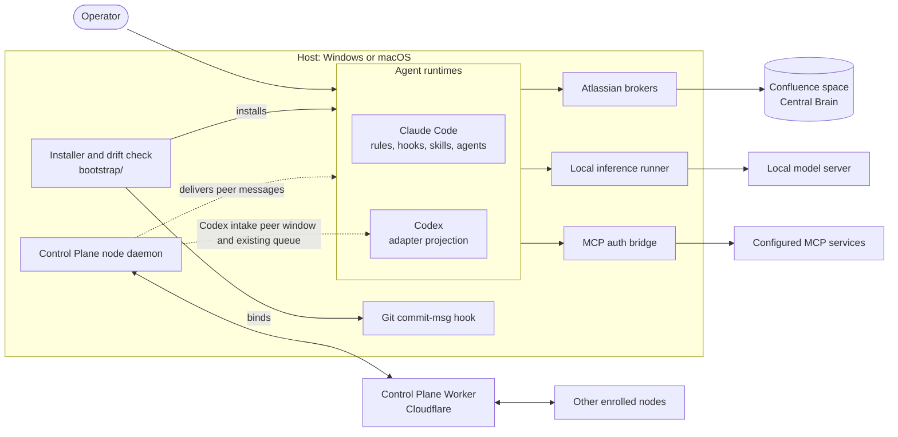

# Kherep

Kherep coordinates coding agents, tools and shared knowledge across Claude Code and Codex. You direct the work; a Maestro plans the task, assigns bounded work and checks the result against code, tests and the requested outcome.

Use Kherep to give your agents consistent working rules, reusable skills and a shared approach to choosing models and tools. Runtime adapters keep Claude and Codex configuration separate while applying the same orchestration principles.

[](https://youtu.be/w9pLDRU_ulo)

*Watch the overview: [Kherep - Your runtimes, Your rules](https://youtu.be/w9pLDRU_ulo)*

## Contents

- [Key capabilities](#key-capabilities)
- [Architecture](#architecture)
- [Supported integrations](#supported-integrations)
- [Installation](#installation)
- [Configuration](#configuration)
- [Security model](#security-model)
- [Documentation](#documentation)
- [Development](#development)
- [Contributing](#contributing)
- [Roadmap](#roadmap)
- [License](#license)

## Key capabilities

- **Maestro agent orchestration:** plan work, delegate focused tasks and verify the combined result.
- **Claude Code and Codex adapters:** shared rules with installation and hooks for each runtime.
- **Rules, hooks and skills:** reusable workflows for implementation, review, debugging and delivery.
- **Model and tool routing:** choose available capabilities through operator-configured policies.
- **MCP integration:** connect explicitly configured services through transport and authentication adapters.
- **Local inference:** use configured local processing routes, including a separate path for private inputs.
- **Central Brain:** a shared knowledge base in a dedicated Confluence space. With a configured space and brokers, durable findings from completed turns become pages: the Claude observation agent files them itself, and the Codex observation agent returns candidates that the Maestro validates and, when authorized, publishes.
- **Turn-completion observations:** after a substantial Claude turn a Stop hook has the Maestro dispatch `claude-obs`, and Codex can dispatch one bounded `codex-obs` pass; see [Codex integration](docs/CODEX.md#turn-completion-observations).
- **Control Plane:** enrolled nodes connect to a Cloudflare Worker. Agent sessions exchange messages accepted by the receiving node's policy. Opt-in Codex wake queues a compact pointer for the original Desktop or Terminal chat; its existing runtime processes the inbox and confirms delivery. Original Windows Desktop wake is verified with CLI 0.160.1 and the Desktop embedded CLI 0.162.0-alpha.17.2; macOS Desktop acceptance remains open. See [Control Plane](modules/control-plane/README.md) for prerequisites, task controls and platform limits.

Backends and integrations are configured separately. Installing an adapter does not provision a model, MCP service or Confluence space.

## Architecture

Kherep is installed from a source checkout into the configuration homes of the agent runtimes on a host. The installer places rules, hooks, skills, agents and routing, binds the Git `commit-msg`, `post-checkout` and `pre-push` hooks and keeps backups. Optional integrations are reached only through configured adapters.



| Component | Directory | Responsibility |
| --- | --- | --- |
| Claude adapter | `claude/` | Rules, hooks, skills, agents, commands and routing for Claude Code |
| Codex adapter | `codex/` | Projection of the shared rules, skills and agents into Codex; see [adapter architecture](codex/ARCHITECTURE.md) |
| Bootstrap | `bootstrap/` | Host profiles, managed installation, backups, drift checks and the commit policy |
| Atlassian brokers | `modules/atl-jira-brokers/` | Jira and Confluence operations under a service account, including the Central Brain space |
| Teamwork Graph | `modules/twg/` | Bounded, read-only Teamwork Graph lookups |
| Local inference | `modules/local-inference/` | Runner for a configured local model server, reached locally or over SSH |
| MCP auth bridge | `modules/mcp-auth-bridge/` | Authenticated transport wrappers for configured MCP servers |
| Control Plane | `modules/control-plane/` | Cloudflare Worker, node daemon and shared protocol for enrollment, session messaging and tasks |

### Central Brain

[](https://raw.githubusercontent.com/cfaysal/kherep/main/assets/illustrations/kherep-brain.svg)

Sessions are reminded to search the space before answering, and the matching pages come back with their evidence status. After a substantial turn, the observation agent files what the turn established through the broker. See the [detailed diagram](https://raw.githubusercontent.com/cfaysal/kherep/main/assets/illustrations/kherep-brain.svg).

### Control Plane

[](https://raw.githubusercontent.com/cfaysal/kherep/main/assets/illustrations/kherep-control-plane.svg)

Sessions on different nodes exchange messages through one Cloudflare Worker, and a session can ask another node to start a new intercom session. A peer message informs; it never approves. See the [detailed diagram](https://raw.githubusercontent.com/cfaysal/kherep/main/assets/illustrations/kherep-control-plane.svg).

## Supported integrations

Each integration is optional unless a component's guide says otherwise, and each needs your own account, service or backend.

| Integration | Used for | Guide |
| --- | --- | --- |
| Claude Code | Runtime adapter with rules, hooks, skills, agents and routing | [Installation](docs/INSTALLATION.md) |
| Codex | Runtime adapter with rules, skills, agents, hooks and MCP projection | [Codex integration](docs/CODEX.md) |
| Confluence | Central Brain knowledge space, written through service-account brokers | [Atlassian brokers](modules/atl-jira-brokers/README.md) |
| Jira | Optional service-account helpers | [Atlassian brokers](modules/atl-jira-brokers/README.md) |
| Atlassian Teamwork Graph | Read-only lookups | [Teamwork Graph](modules/twg/README.md) |
| MCP servers | Transport and authentication adapters for servers you configure | [Codex adapter architecture](codex/ARCHITECTURE.md#mcp-projection) |
| Local model server | Local inference, including the private-input route | [Installation](docs/INSTALLATION.md#5-configure-integrations) |
| Cloudflare Workers and Access | Control Plane Worker and its Access-protected operator API | [Control Plane](modules/control-plane/README.md#setup) |

## Installation

Use Node.js 24, npm and Git. The Claude installer also needs Bash; on Windows use Git Bash.

```sh
git clone https://github.com/cfaysal/kherep.git
cd kherep
npm ci
```

Follow the [installation guide](docs/INSTALLATION.md) to select your workspace, review an isolated installation and set up the required runtime. The guide's isolated preview writes into a new candidate directory and leaves your live configuration unchanged; inspect it before installing for real. For Codex, follow [Codex integration](docs/CODEX.md). For the Central Brain space and the brokers that write to it, see [Atlassian brokers](modules/atl-jira-brokers/README.md).

Runtime adapters target Windows and macOS. See each component's documentation for its requirements.

After installation, confirm the result in the runtime itself as described in [Verify the installed runtime](docs/INSTALLATION.md#verify-the-installed-runtime). `bootstrap/drift-check.sh` compares the managed source with the installed files and exits non-zero on drift.

## Configuration

Kherep is configured through environment variables at installation time and operator files outside the checkout. Connection profiles ship unconfigured. The settings, their defaults and the model and work-item policies are listed in [Configure integrations](docs/INSTALLATION.md#5-configure-integrations) and [Model and work-item policy](docs/INSTALLATION.md#model-and-work-item-policy).

Keep personal configuration and credentials outside the checkout.

## Security model

- **Credentials stay outside the checkout.** Integration configuration lives under an operator-chosen root, and Jira and Confluence writes go through brokers that act as a service account.
- **The Git `commit-msg` hook is the enforcement boundary for every runtime.** It applies the host's commit policy, including optional work-item keys, and rejects AI attribution trailers. The Claude `commit-guard` hook gives earlier feedback; it does not replace the Git hook.
- **Claude guards check tool calls before they run.** They keep private paths and local-inference artifacts out of agents, workflows, web and MCP tools; block shell commands whose output is likely to print secrets; require explicit confirmation for production deploys, force pushes and destructive Kubernetes and Helm commands; keep the main checkout of a managed repository on its default branch, so feature work happens in a worktree; and enforce the model policy for agent dispatch. In Codex the shared guards run through the hook adapter, and the Git `post-checkout` hook warns when a main checkout leaves its default branch anyway.
- **Pushes and pull requests are attributed locally.** The Git `pre-push` hook and a `PostToolUse` hook for `gh pr create` record which session pushed which ref or opened which PR in a host-local log, mode `0600` and trimmed after 90 days. The log holds ids, refs, SHAs and PR numbers, never commit subjects, PR text or tokens, and never leaves the host. Its session ids are what the runtime reported, so they attribute work; they do not authenticate it.
- **Hook integrity is checked at session start.** Wired hook files that are missing, empty or unloadable are detected and repaired from the versioned source.
- **Installation is reviewable and reversible.** An isolated preview, managed backups and a drift check precede and follow changes to a live configuration.
- **The Control Plane authenticates nodes and operators separately.** Nodes hold Ed25519 keys and connect with a signed challenge; the operator API requires a verified Cloudflare Access token; peer messages reach a session only as framed content that is not a user instruction. See the [Control Plane security model](modules/control-plane/README.md#security-model).

To report a vulnerability, follow the [security policy](.github/SECURITY.md).

## Documentation

| Guide | Purpose |
| --- | --- |
| [Installation](docs/INSTALLATION.md) | Claude setup, isolated preview, upgrades and rollback |
| [Codex integration](docs/CODEX.md) | Codex installer options and runtime verification |
| [Codex adapter architecture](codex/ARCHITECTURE.md) | Memory backends, research enforcement, hook integrity and MCP projection in Codex |
| [Atlassian brokers](modules/atl-jira-brokers/README.md) | Jira and Confluence service-account operations, including the Central Brain space |
| [Control Plane](modules/control-plane/README.md) | Cloudflare Worker and node daemon for node enrollment, liveness, session messaging and task sessions |
| [Teamwork Graph](modules/twg/README.md) | Runtime contract and installation of the Teamwork Graph integration |
| [Public release review](docs/PUBLIC-RELEASE.md) | Review steps before pushing and before tagging a release |
| [Changelog](CHANGELOG.md) | Notable changes per release |
| [Security policy](.github/SECURITY.md) | Private vulnerability reporting |
| [Contributing](CONTRIBUTING.md) | Source setup and test commands |
| [Agent instructions](AGENTS.md) | Reading order and repository working rules |

## Repository layout

| Directory | Contents |
| --- | --- |
| `claude/` | Claude rules, hooks, skills, agents and routing |
| `codex/` | Codex adapters, plugin projection, installers and parity checks |
| `bootstrap/` | Host profiles, managed installation, backups and drift checks |
| `modules/local-inference/` | Local processing runner and configuration |
| `modules/mcp-auth-bridge/` | Authenticated MCP transport adapters |
| `modules/atl-jira-brokers/` | Operator-configured Jira and Confluence service-account operations |
| `modules/twg/` | Bounded Teamwork Graph reads |
| `modules/control-plane/` | Control Plane Worker, node daemon and their shared protocol |
| `lib/` | Shared helpers for `KHEREP_*` environment lookup and Windows workspace paths |
| `docs/` | Installation, Codex and release guides, and design plans |
| `assets/` | Branding banner and illustrations |
| `.github/` | CI workflows, issue and pull request templates, security policy |

## Development

Kherep's TypeScript runs directly on Node.js through type stripping; `tsc` is the type check only.

```sh
npm ci
npm run typecheck
npm run test:bootstrap
```

[CONTRIBUTING.md](CONTRIBUTING.md) lists the checks for each component. CI runs the suites on Linux, macOS and Windows for every pull request.

## Contributing

Track changes in [GitHub Issues](https://github.com/cfaysal/kherep/issues). Changes reach `main` only through a pull request, merged by rebase. See [CONTRIBUTING.md](CONTRIBUTING.md) for setup, checks and conventions.

## Roadmap

Planned and in-progress work is tracked as [open issues](https://github.com/cfaysal/kherep/issues). Released changes and the `[Unreleased]` section are in the [changelog](CHANGELOG.md).

## License

Kherep is licensed under the [Apache License 2.0](LICENSE); see [NOTICE](NOTICE). Bundled and adapted third-party material keeps its own license, listed in [THIRD-PARTY-NOTICES.md](THIRD-PARTY-NOTICES.md).

Claude, Claude Code, Codex, Atlassian, Jira, Confluence and other product names are trademarks of their respective owners; Kherep is an independent project and is not affiliated with or endorsed by Anthropic, OpenAI or Atlassian.
