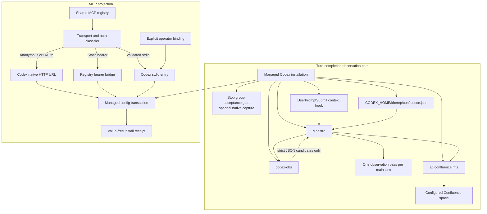

# Codex adapter architecture

The Codex adapter projects shared Kherep capabilities into a separate Codex configuration. It does not copy credentials into its receipt or managed native HTTP entries.

## Memory backends

Memory is unconfigured. The only accepted explicit `InstallOptions.memoryProvider` or `--memory-provider-config` selection is `{ "provider": "unconfigured" }`; the installer persists it in `orchestra/memory-provider.json`. Shared knowledge is the Central Brain: a dedicated Confluence space that `codex-obs` candidates reach through the trusted Maestro and the service-account broker (see turn-completion observations below). Invalid selections stop installation.

The earlier `central-brain` MCP backend is retired. An explicit selection of it is refused. A persisted selection is reported as `retiredMemoryProvider` in the receipt and replaced by the unconfigured selection, with the previous file in the installation backup. Its path references are used only to rebuild the managed block the old installer wrote (`lib/retired-central-brain.mts`), so that exact block, including its MCP table and native hooks, is recognised as managed and replaced. Any other block is refused, not overwritten.

The Maestro context hook emits routing and safety reminders. It does not forward prompt or turn content. Generic CLI execution and exact plugin-table updates live in `lib/codex-cli.mts` and `lib/plugin-config.mts`; local Maestro and optional Rovo registration use these helpers. Custom configuration, unrelated plugins and the computer-use notify wrapper remain intact. Only the exact owned retired notify is detached. File retirement uses the existing reversible install transaction. Original integration artifacts and historical evidence are preserved externally, outside the publishable tree.

Existing reminders and acceptance hooks remain configured. Every managed hook also carries `commandWindows`, the same command behind the PowerShell call operator `&`, because Codex on Windows runs a hook through `pwsh -NoProfile -Command`, where a command that starts with a quoted path does not parse. Historical renderers keep their original bytes, including the retired native hook commands and the blocks without `commandWindows`, so upgrades recognize exact prior blocks. The receipt establishes configuration only. Current Codex hook trust and feature policies must allow execution at the actual host; Desktop execution remains UNKNOWN until independently measured. `prepared` and `injected_port_prepared` describe prepared output, not native delivery or model use.

## Turn-completion observations

Both hosts project an acceptance-only `Stop` group. The `UserPromptSubmit` Maestro context hook supplies a quiet per-turn instruction to dispatch `codex-obs` once before final. Previous macOS combined and Windows separate observation Stop blocks are recognized as managed and replaced during reinstall. Their old script files may remain installed but are not configured, so they cannot produce user-visible observation continuation prompts.

The normal projection installs the `codex-obs` role from `codex/agents/codex-obs.md` and the ten-file minimal Codex service-account Confluence graph. That graph consists of `atl-confluence.mts`, the shared `atlassian-credentials.mts` parser and eight Confluence modules: contract, content, session, related, semantic, neighbours, neighbour CLI and runtime label. The Maestro sends only a bounded nonprivate summary to the worker with `fork_turns: "none"`. The installer copies `parity/capabilities.json` to `hooks/parity/` in the Codex home, beside the `hooks/kherep-maestro` directory that holds the dispatch guard. The guard reads the `codex-obs` model pin from that file and denies a dispatch of that agent without the pinned model. The worker returns strict JSON candidates and performs no configuration or broker I/O. Its projected `sandbox_mode = "read-only"` prevents worker filesystem writes; restricted subagent execution withholds the Maestro's escalated network authority. The candidate envelope includes `title`, `bodyStorage`, `evidence`, `labels` and `placement`. The Maestro validates it, checks canonical publishing authority, and uses the Codex service-account broker for related search, create/readback and stitch. Empty `observations` means zero writes. The context hook forwards no prompt or transcript content.

The canonical host target is `<CODEX_HOME>/kherep/confluence.json`. On migration, `orchestra/confluence.json` may supply only its `spaceKey`. The setup helper revalidates that key through the Codex `atl-confluence.mts` service-account broker before writing the canonical file, and retains the legacy file. The PowerShell `-AuthorizeObservationPublishing` switch explicitly adds literal `observationPublishingAuthorized: true`. Reinstallation without the switch preserves an existing canonical literal `true` only when the prior canonical `spaceId` equals the newly resolved `spaceId`; a fresh install or changed space identity omits the property, and a legacy file can never supply it. The helper never persists false.

Before a Codex write, the trusted Maestro main thread reads the canonical file and requires the authority property to be literal `true`; absence or any other value produces `publication not authorized` and no write. The value is durable standing authority only for non-secret observation pages in that configured space through the Codex service account. It grants no authority over other spaces, content types, secrets, identities or permissions. The candidate worker cannot publish and does not read configuration. This is a Codex-only split and leaves Claude's direct broker path unchanged. Jira, Rovo and the Claude Jira and Confluence brokers remain optional. Codex and Claude service-account credential bindings remain separate.

Installed source and configuration prove only what was projected. They do not prove that the host trusted or ran the hook, that an automatic observation dispatch occurred, or that Confluence accepted and read back a write. Manual one-observation delivery, a manual `0 observations` result and automatic quiet main-turn dispatch are separate acceptance evidence. Until each is measured at the Windows target, its live status is UNKNOWN.

## MCP projection

Transport and authentication are separate decisions. Credential-free HTTPS endpoints, plus loopback HTTP endpoints, use Codex native HTTP so Codex can perform OAuth when the service requests it. An HTTP source with the exact supported static Bearer header stays behind `registry-http-wrapper.mts`; the credential remains in the private source registry. Other headers and credential-bearing URLs fail closed.

The Central Brain Confluence space is the supported shared knowledge base. Configured unrelated MCP services remain optional and preserve their transport and authorization rules. Obsolete or edited managed configurations require explicit operator recovery when exact ownership cannot be verified.

The only product-specific stdio binding is the n8n secret-file bearer adapter. A caller supplies its auth file and HTTPS endpoint through `InstallOptions.mcpCompatibility.operatorBindings.n8n`. The installer constructs the Node command and `supergateway-secret-wrapper.mts` arguments. Normal operating-system trust is the default. An existing CA file may be supplied with `caFile`. The mutually exclusive `tlsMode: "legacy-disabled"` preserves an already-authorized per-process compatibility setting only when the caller explicitly requests it.

## Upgrade repair

The installer repairs only exact, owned historical forms. `sourceNames` maps a canonical capability to a differently named private registry source. `legacyServerNames` lists old Codex table names for that capability. `legacyEnvPrefixes` lists explicit old product prefixes and each value must include its trailing underscore, for example `LEGACY_`.

Repairs accept the exact owned environment as either an inline table or Codex's separate `[mcp_servers.<name>.env]` table. Key order and omitted default booleans do not affect ownership validation. Repairs retain private values, disabled state, timeouts, tool policy subtables and unrelated MCP entries. A known legacy source without a validated replacement stays configured and receives `configured-source-repair-required` in the receipt. A later ordinary installer run without compatibility options preserves exact native HTTP, static bearer and n8n entries previously produced by a validated repair.

All writes use the existing install transaction and backup. Rollback restores the prior configuration and managed files.

The Central Brain Confluence space is the supported shared knowledge base. Configured unrelated MCP services remain optional and preserve their transport and authorization rules. Obsolete or edited managed configurations require explicit operator recovery when exact ownership cannot be verified.
