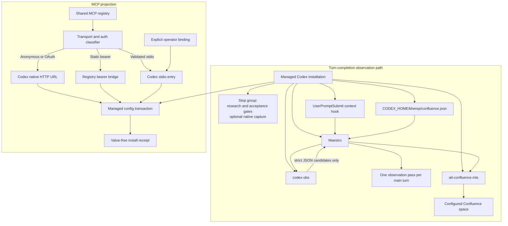

# Codex adapter architecture

The Codex adapter projects shared Kherep capabilities into a separate Codex configuration. It does not copy credentials into its receipt or managed native HTTP entries.

## Memory backends

Memory is unconfigured. The only accepted explicit `InstallOptions.memoryProvider` or `--memory-provider-config` selection is `{ "provider": "unconfigured" }`; the installer persists it in `orchestra/memory-provider.json`. Shared knowledge is the Central Brain: a dedicated Confluence space that `codex-obs` candidates reach through the trusted Maestro and the service-account broker (see turn-completion observations below). Invalid selections stop installation.

The earlier `central-brain` MCP backend is retired. An explicit selection of it is refused. A persisted selection is reported as `retiredMemoryProvider` in the receipt and replaced by the unconfigured selection, with the previous file in the installation backup. Its path references are used only to rebuild the managed block the old installer wrote (`lib/retired-central-brain.mts`), so that exact block, including its MCP table and native hooks, is recognised as managed and replaced. Any other block is refused, not overwritten.

The Maestro context hook emits routing and safety reminders. It does not forward prompt or turn content. Generic CLI execution and exact plugin-table updates live in `lib/codex-cli.mts` and `lib/plugin-config.mts`; local Maestro registration uses these helpers. The optional Atlassian tool set adds the v2 Atlassian remote MCP server (`atlassian`, `https://mcp.atlassian.com/v2/mcp`) to the managed block; the v1 `rovo` table is retired. Custom configuration, unrelated plugins and the computer-use notify wrapper remain intact. Only the exact owned retired notify is detached. File retirement uses the existing reversible install transaction. Original integration artifacts and historical evidence are preserved externally, outside the publishable tree.

Existing reminders and acceptance hooks remain configured. Every managed hook also carries `commandWindows`, the same command behind the PowerShell call operator `&`, because Codex on Windows runs a hook through `pwsh -NoProfile -Command`, where a command that starts with a quoted path does not parse. Historical renderers keep their original bytes, including the retired native hook commands and the blocks without `commandWindows`, so upgrades recognize exact prior blocks. The receipt establishes configuration only. Current Codex hook trust and feature policies must allow execution at the actual host; Desktop execution remains UNKNOWN until independently measured. `prepared` and `injected_port_prepared` describe prepared output, not native delivery or model use.

## Research enforcement

The managed `UserPromptSubmit` group runs `codex-research-first.mts` beside the Maestro context hook. It emits only a fixed evidence-first instruction, the configured workspace's quoted Codex broker path, and a validated space key or a fixed configuration pointer. It never echoes the prompt. The managed `Stop` group runs `codex-research-stop.mts` with the acceptance gate. On a substantial current turn, the research hook requires a structured Central Brain lookup attempt and, after a detected repository edit, a codebase-memory call. A final `[research: none - <reason>]` with a nonempty reason is the explicit opt-out. `stop_hook_active` must be exactly false, so the continuation can occur only once.

The parser reads the local Codex rollout named by the Stop payload and emits no transcript content. It prefers a matching `turn_id` and `task_started` boundary, then reads `response_item` messages, `function_call` and `custom_tool_call` records. Direct codebase-memory names accept the hyphenated and underscored server forms. For `functions.exec`, a local lexer recognizes actual `tools.*(...)` call syntax while excluding strings, comments, template literals and regular-expression literals in its supported JavaScript contexts. Dynamically constructed JavaScript remains outside this classifier. This is syntactic evidence of an attempted nested call. It cannot prove that a conditional branch executed or that the lookup succeeded. Repository edits are recognized from `apply_patch`, the explicit file-write tools and common shell mutation commands. Arbitrary programs can mutate code without a locally recognizable command, so that path remains unenforced.

Codex documents the rollout transcript as unstable. A missing or relative path, a Claude-private path, an unreadable file, an unknown current-turn boundary or a wholly unrecognized record shape is undecidable and fails open. A malformed trailing line is ignored when earlier records still establish the requested current turn. The hook prints only a fixed continuation reason and performs no network request. Codex Stop precedence also matters: any matching hook that returns `continue: false`, including the acceptance gate, takes precedence over a research `decision: "block"`. Research continuation is therefore effective when the acceptance gate allows the turn to stop. The research parity check covers only the two named Claude and Codex research hook counterparts; it is not a claim of generic runtime parity.

The current installer recognizes the exact managed block from immediately before these two hooks and replaces it transactionally. That upgrade support is separate from live execution: repository tests and an installed config establish projection, while actual Desktop discovery and one observed continuation are still UNKNOWN until checked on each target host.

## Patch privacy input

The hook adapter expands a framed `apply_patch` input into explicit file operations before `pre-privacy` evaluation. It accepts a raw patch string or an `input`/`patch`/`command` wrapper and checks every add, update, delete and move target. Ambiguous headers or missing targets retain a denied file-tool shape. The normalized input keeps the full original payload and a content view without diff prefixes, so protected paths in added/removed content remain visible to the existing privacy evaluator. The privacy guard, shell handling and best-effort post-hook scanner are unchanged.

In the PreToolUse phases (`pre`, `pre-no-transcript`, `pre-privacy`) the adapter answers a wrapped guard's exit 2 with the documented Codex deny on stdout, `{"hookSpecificOutput":{"hookEventName":"PreToolUse","permissionDecision":"deny","permissionDecisionReason":"..."}}`, and exits 0. The reason is the guard's trimmed stderr, or a fixed text naming the guard when stderr is empty. Codex blocks only on exit 2 with a stderr reason or on that JSON with exit 0, and on Windows it runs `commandWindows` under pwsh, which reports a native exit 2 as 1, a non-blocking failure. The first blocking item of a multi-command payload answers alone; nothing after it runs, and output earlier items wrote to stdout is dropped so the deny stays the only JSON document. A guard's own JSON on exit 0 passes through, any other exit keeps its code, and the PostToolUse `post` phase is unchanged (issue #258).

The shell `PreToolUse` group runs four shared Claude guards through the adapter: `commit-guard.mts` and `main-checkout-guard.mts` in the `pre` phase, `deploy-guard.mts` in `pre-no-transcript`, and `playwright-file-guard.mts` directly in its own group. `main-checkout-guard.mts` (issue #325) refuses a branch switch, a detached checkout and branch creation in the main checkout of a workspace repository, whose git-dir equals its common-dir, and passes file checkouts and every linked worktree. It is appended as the last entry of the group, after `deploy-guard.mts`, because Codex trust keys are positional; the installer recognizes the exact managed block from immediately before it and replaces it, and Codex then asks to review that one new hook. The guard imports `lib/main-checkout.mts` from the `claude/hooks/lib` copy the installer places beside it.

## Hook integrity

`hooks/hook-integrity.mts` is installed as `<CODEX_HOME>/hooks/kherep-maestro/codex-hook-integrity.mts` and runs as the last entry of the Maestro `SessionStart` group with `timeout = 30`. It is appended after the optional native hook because Codex trust keys are positional: every earlier entry keeps its index and its trust. It is the Codex counterpart of `claude/hooks/live-hook-integrity.mts`, which only runs when a Claude session starts.

It reads every `command` of every `[[hooks.<event>.hooks]]` table in `config.toml`, decodes it as a TOML basic string (a literal string is taken raw), and keeps the double-quoted `.mts` and `.js` parts under `<CODEX_HOME>/hooks`. To those it adds their relative import closure through `claude/hooks/lib/hook-inventory.mts`, plus the libs `codex-privacy-boundary-guard.mts` loads through a computed `require` (`workspace-scope`, `private-path-policy`, `private-path-rules`, `real-path-policy`). Each file is OK, broken (absent, 0 bytes, rejected by `lib/hook-syntax.mts`) or unchecked. A broken file is restored from the checkout that the control-plane deliver-hook command names, else from `lib/orchestra-checkout.mts`: `lib/<x>` from `claude/hooks/lib/<x>`, a shared guard from `claude/hooks/<name>`, `codex-<name>.mts` from `codex/hooks/<name>.mts`, the Codex helpers and `kherep-maestro-context.mts` from `codex/hooks`. The write goes through `lib/restore-write.mts`. A restore counts only when a re-read of the target has a size above 0 and the SHA-256 of the checkout bytes. The two observation hooks are rendered by the installer, so a broken one is reported with the hint to rerun `codex/install.mts`. Without a checkout nothing is written. Every finding is appended to `<CODEX_HOME>/.cache/hook-integrity/incidents.jsonl`, with the fields of the Claude journal.

Its own five libs are loaded with a dynamic `import()` from `./lib` beside the installed file, else from the checkout's `claude/hooks/lib`, and each used export must be a function. A lib that does not load is reported as kind `self`; it is restored only when `workspace-scope`, `orchestra-checkout` and `restore-write` loaded. The hook is silent when everything is OK. Otherwise it prints one JSON document with `systemMessage` and `hookSpecificOutput.additionalContext`. A Codex `SessionStart` hook cannot block, so it always exits 0. The installer recognizes the exact managed block from immediately before this hook and replaces it; Codex then asks to review exactly the one new hook.

## Turn-completion observations

Both hosts project the research and acceptance `Stop` hooks. The `UserPromptSubmit` Maestro context hook supplies a quiet per-turn instruction to dispatch `codex-obs` once before final. Previous macOS combined and Windows separate observation Stop blocks are recognized as managed and replaced during reinstall. Their old script files may remain installed but are not configured, so they cannot produce user-visible observation continuation prompts.

The normal projection installs the `codex-obs` role from `codex/agents/codex-obs.md` and the twelve-file minimal Codex service-account Confluence graph. That graph consists of `atl-confluence.mts`, the shared `atlassian-credentials.mts` parser, the shared `atlassian-cli-args.mts` argument parser and nine Confluence modules: contract, content, session, related, semantic, neighbours, neighbour CLI, runtime label and label CLI. The Maestro sends only a bounded nonprivate summary to the worker with `fork_turns: "none"`. The installer copies `parity/capabilities.json` to `hooks/parity/` in the Codex home, beside the `hooks/kherep-maestro` directory that holds the dispatch guard. The guard reads the `codex-obs` model pin from that file and denies a dispatch of that agent without the pinned model. The worker returns strict JSON candidates and performs no configuration or broker I/O. Its projected `sandbox_mode = "read-only"` prevents worker filesystem writes; restricted subagent execution withholds the Maestro's escalated network authority. The candidate envelope includes `title`, `bodyStorage`, `evidence`, `labels` and `placement`. The Maestro validates it, checks canonical publishing authority, and uses the Codex service-account broker for related search, create/readback and stitch. Empty `observations` means zero writes. The context hook forwards no prompt or transcript content.

The canonical host target is `<CODEX_HOME>/kherep/confluence.json`. On migration, `orchestra/confluence.json` may supply only its `spaceKey`. The setup helper revalidates that key through the Codex `atl-confluence.mts` service-account broker before writing the canonical file, and retains the legacy file. The PowerShell `-AuthorizeObservationPublishing` switch explicitly adds literal `observationPublishingAuthorized: true`. Reinstallation without the switch preserves an existing canonical literal `true` only when the prior canonical `spaceId` equals the newly resolved `spaceId`; a fresh install or changed space identity omits the property, and a legacy file can never supply it. The helper never persists false.

Before a Codex write, the trusted Maestro main thread reads the canonical file and requires the authority property to be literal `true`; absence or any other value produces `publication not authorized` and no write. The value is durable standing authority only for non-secret observation pages in that configured space through the Codex service account. It grants no authority over other spaces, content types, secrets, identities or permissions. The candidate worker cannot publish and does not read configuration. This is a Codex-only split and leaves Claude's direct broker path unchanged. Jira, the v2 Atlassian MCP server and the Claude Jira and Confluence brokers remain optional. Codex and Claude service-account credential bindings remain separate.

Installed source and configuration prove only what was projected. They do not prove that the host trusted or ran the hook, that an automatic observation dispatch occurred, or that Confluence accepted and read back a write. Manual one-observation delivery, a manual `0 observations` result and automatic quiet main-turn dispatch are separate acceptance evidence. Until each is measured at the Windows target, its live status is UNKNOWN.

## MCP projection

```mermaid
flowchart TB
    subgraph T[Turn-completion observation path]
        direction LR
        I[Managed Codex installation] --> ST[Stop group:<br/>research and acceptance gates<br/>optional native capture]
        I --> MA[Maestro]
        I --> OB[codex-obs]
        I --> UC[UserPromptSubmit context hook]
        UC --> MA
        MA --> OB
        OB -->|strict JSON candidates only| MA
        MA --> NR[One observation pass per main turn]
        I --> CB[atl-confluence.mts]
        I --> CT[CODEX_HOME/kherep/confluence.json]
        CT --> MA
        MA --> CB
        CB --> CS[Configured Confluence space]
    end

    subgraph P[MCP projection]
        direction LR
        R[Shared MCP registry] --> C[Transport and auth classifier]
        C -->|Anonymous or OAuth| H[Codex native HTTP URL]
        C -->|Static bearer| B[Registry bearer bridge]
        C -->|Validated stdio| S[Codex stdio entry]
        O[Explicit operator binding] --> S
        H --> M[Managed config transaction]
        B --> M
        S --> M
        M --> Q[Value-free install receipt]
    end

    I --> M
```

Transport and authentication are separate decisions. Credential-free HTTPS endpoints, plus loopback HTTP endpoints, use Codex native HTTP so Codex can perform OAuth when the service requests it. An HTTP source with the exact supported static Bearer header stays behind `registry-http-wrapper.mts`; the credential remains in the private source registry. Other headers and credential-bearing URLs fail closed.

The Central Brain Confluence space is the supported shared knowledge base. Configured unrelated MCP services remain optional and preserve their transport and authorization rules. Obsolete or edited managed configurations require explicit operator recovery when exact ownership cannot be verified.

The only product-specific stdio binding is the n8n secret-file bearer adapter. A caller supplies its auth file and HTTPS endpoint through `InstallOptions.mcpCompatibility.operatorBindings.n8n`. The installer constructs the Node command and `supergateway-secret-wrapper.mts` arguments. Normal operating-system trust is the default. An existing CA file may be supplied with `caFile`. The mutually exclusive `tlsMode: "legacy-disabled"` preserves an already-authorized per-process compatibility setting only when the caller explicitly requests it.

The Control Plane messaging client is a separate opt-in stdio projection selected through
`InstallOptions.messagingClient` or `--enable-messaging-client`. Its managed table contains the Node
runtime, installed bridge and non-secret config-root paths only. The installer copies the bridge,
intent hook and their public Control Plane dependency graph together. It also renders one exact
PreToolUse matcher for the five messaging tools. The hook supplies updated arguments after durable
intent registration and adds no approval decision.

The bridge reads current policy and the private credential for every HTTP call, so rotation and
disable take effect without restarting the stdio process. It verifies POSIX ownership and private
mode or the equivalent current-user Windows ACL allowlist before reading credential bytes. It derives the credential-free `/mcp`
endpoint from local node configuration and forwards native JSON-RPC metadata without substitution.
The bearer is confined to the HTTP Authorization header. The normal projection remains free of this
table and hook; client opt-in does not enable the node capability or Worker route.

## Upgrade repair

The installer repairs only exact, owned historical forms. `sourceNames` maps a canonical capability to a differently named private registry source. `legacyServerNames` lists old Codex table names for that capability. `legacyEnvPrefixes` lists explicit old product prefixes and each value must include its trailing underscore, for example `LEGACY_`.

Repairs accept the exact owned environment as either an inline table or Codex's separate `[mcp_servers.<name>.env]` table. Key order and omitted default booleans do not affect ownership validation. Repairs retain private values, disabled state, timeouts, tool policy subtables and unrelated MCP entries. A known legacy source without a validated replacement stays configured and receives `configured-source-repair-required` in the receipt. A later ordinary installer run without compatibility options preserves exact native HTTP, static bearer and n8n entries previously produced by a validated repair.

All writes use the existing install transaction and backup. Rollback restores the prior configuration and managed files.

The Central Brain Confluence space is the supported shared knowledge base. Configured unrelated MCP services remain optional and preserve their transport and authorization rules. Obsolete or edited managed configurations require explicit operator recovery when exact ownership cannot be verified.
