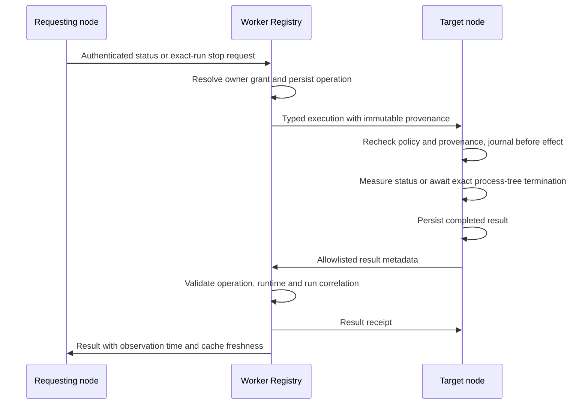

# Control Plane architecture

The Worker authenticates enrolled nodes over outbound WebSockets. `NodeSession`
terminates each connection; `Registry` owns shared identities, messages, task
requests and owner-control records in SQLite. Local node policy remains an
additional execution gate. The [README](README.md#architecture) maps the existing
modules and operator API.

## Owner task control

`protocol-task-control.mts` defines strict event bodies carried in the existing
`event` envelope. This does not widen the generic command allowlist.

- `worker/src/task-control-grants.mts` binds immutable task, owner, target and
  runtime identities to delegated requests or authenticated source messages.
  Source-message associations have monotonic versions; delayed registrations
  cannot restore an older discovery mapping. Existing task ownership is preserved.
- `worker/src/task-control-store.mts` persists operations by owner and request id.
  A conflicting reuse is denied. Results must match the recorded target, action,
  runtime and expected run. Pending operations can be retried by their exact id.
- `worker/src/task-control-registry.mts` checks ownership, capabilities and
  revocation before resolving, dispatching or returning a request. Routing and
  frames modules connect that store to authenticated node sockets.
- `node/task-control-registration.mts` retains successful grant receipts and
  registration history for local intercom delivery associations.
- `node/task-control-store.mts` journals execution before any effect and saves
  results before sending. Restart recovery reports uncertainty without replaying
  a process signal. The daemon serializes control operations across reconnects.
- `node/task-control-local.mts` checks current policy and local provenance, measures
  process identity and calls the awaited Codex stop path. A run hash binds task,
  runtime, process id and process creation time; these process details stay local.
- `node/task-control-cli.mts` queues requests and distinguishes a status timeout
  before stop submission from a pending submitted stop.

## Trust and data boundaries

`sessions.ownTaskControl` defaults to false. Both nodes must advertise the dedicated
capability, and the target must permit the runtime. Revocation and target policy
remain effective after initial registration. Operator tasks are not owner grants.
An enrolled node is the authenticated principal; a session name is a routing label,
not a security boundary between Desktop chats.

Task-control storage contains identifiers, state, observation time and fixed error
codes. It does not transport prompts, message bodies, transcripts, local paths or
process ids. Existing message delivery and its body-retention rules are unchanged.
Fresh measurement and cached results are explicit; connectivity or missing data is
never evidence that a process stopped. Claude process state remains unknown and its
remote stop is unsupported until an equivalent live identity check exists.

## Compatibility and activation

Ship the Worker and node source together, then explicitly activate node policy.
Older nodes without the capability cannot participate. Existing task records without
trusted provenance are not granted ownership retroactively. A local intercom task
can register once its source message and delivery identity are available. Reverting
the opt-in policy disables execution without removing the durable audit records.
