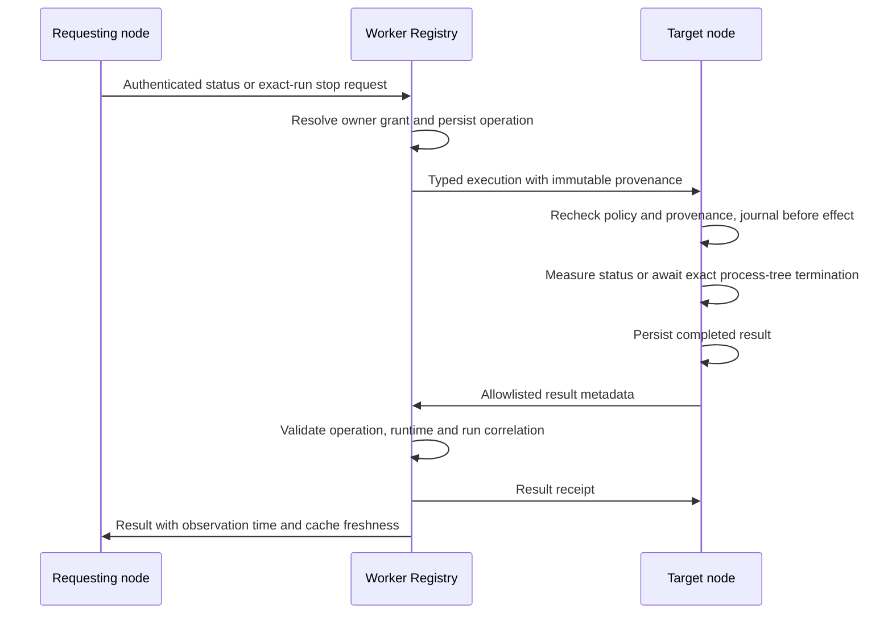

# Control Plane architecture

## Codex intake peer progress

The daemon retains one runtime-mutation lane. Only around its awaited
`pollCodexInbound`, after preceding MCP polling and registration publication,
`node/codex-intake-window.mts` admits validated message receipts, sender statuses,
MCP intent receipts and deliveries to positively recorded full Codex IDs. Its
serialized jobs use the real client callbacks and the existing exchange/CP admission
paths. Task threads remain excluded from interactive hint admission; CP records admission,
not an offer or delivery. Claude targets, aliases, unknown targets, commands,
task control, MCP inbox requests and authentication remain on the original lane.

The window pins the socket and the policy actually applied by the last client
refresh, including a refresh inside MCP polling. Its CP admission runner copy uses that
same policy; the existing task intake runner is not changed. A required policy
read must still match before admission. Missing, invalid or unreadable policy,
drift, lost authentication, socket close/replacement or daemon stop permanently
closes that window. Unprocessed frames return to the original lane; an unaccepted
delivery on a closed socket receives no ACK and remains the Worker's obligation.

The main lane drains admitted callback publication before another frame allocator
can run. A callback already admitted may finish its response after policy drift,
but cannot admit another CP hint. Admissions already handed to the
existing serial lane may complete after the window closes, with fresh guards. This does not add queue
revocation or fix waits in authentication, new MCP-intent registration, commands
or other daemon phases. It does not identify the cause of a particular live stall.

The Worker authenticates enrolled nodes over outbound WebSockets. `NodeSession`
terminates each connection; `Registry` owns shared identities, messages, task
requests and owner-control records in SQLite. Local node policy remains an
additional execution gate. The [README](README.md#architecture) maps the existing
modules and operator API.

The Worker keeps one authenticated WebSocket per node identity. When a newer
connection replaces it, the older daemon receives close code 4409, clears its
connection timers and exits instead of reconnecting. Unknown or revoked identity
code 4403 is terminal too; transport closes continue through the bounded backoff.

## Remote MCP candidate

The daemon serializes native-intent polling with other node frames. It registers cached known callers first; unresolved callers refresh and publish the complete current session snapshot on that same connection before their intents. Discovery is bounded by two seconds and the remaining local enqueue window; expired unregistered intents stop retrying. Periodic discovery waits outside the frame lane and is cancelled by any newer recorded listing or socket closure, preventing stale publication and late record updates while retaining its ordinary budget. The daemon rereads policy after native discovery, publishes capability changes, and rechecks authentication and MCP opt-in before allocating the snapshot. Warm callers avoid discovery. Unsent snapshots remain eligible for republication, and failed discovery leaves the prior population intact without sending an unknown-session intent. The Registry's session/runtime requirement and the eight-second trusted-hook deadline are unchanged. The ordered flow is shown in [MCP.md](MCP.md#components).

The optional `/mcp` route composes a stateless official SDK v2 handler with the existing Registry and message router. It adds no protocol-session Durable Object. A per-node bearer authenticates HTTP, while each tool effect also requires a short-lived native call intent registered and durably acknowledged over that node's authenticated WebSocket. Registry claim and message creation share one transaction for write tools. Capability, credential version and exact session runtime are rechecked at claim time.

The base `mcp.messaging.v1` opt-in enables Codex. Claude Code also requires literal
`remoteMcp.claudeCode: true`, advertised as `mcp.messaging.claude.v1`. Its hook records the actual
native session and tool-use ID before HTTP; the HTTP claim carries only the actual Claude native
tool-use ID and resolves the source session from that prior intent. Codex continues to supply native
session, thread and call metadata. Mixed identity fields are refused, and neither path accepts
model-supplied session identity. Removing only the extra Claude capability deletes its intents while
preserving Codex intents and the shared credential; re-enabling cannot revive deleted intents.
The exact identity contracts are tabulated in [MCP.md](MCP.md#runtime-specific-native-identity).

Inbox reads use a typed in-memory request on the originating `NodeSession`. The response is accepted only from the socket that received the request. Body text is returned to the waiting HTTP call and is absent from command history, Registry storage, audits and logs. Reading does not advance delivery state. An MCP `reply` to a message the Registry already deleted after its sender's acknowledgement (issue #308) uses the same request for that one item (`messageId`, `reply: true`) and then completes the send with a reply depth the Registry derives from the tombstone. [MCP.md](MCP.md) defines the complete flow, activation gates and tested limits.

The route flag and node capability both default off. Credential provisioning happens only on the authenticated node socket. The daemon applies policy changes on each exchange round and before processing authentication completion. Removing the MCP opt-in immediately blocks local inbox and intent handling and clears private local MCP exchange state. The daemon retries a reduced registration after a failed socket send; once received, Registry capability retraction transactionally invalidates the credential and intents. Reconnect polling resends only unacknowledged local intent metadata while enabled; idempotent Registry registration preserves the original expiry and does not rewrite an unchanged intent.

Registry admission separates the per-node limit of 128 unexpired intents from the replay ledger limit of 32,768 retained rows. A claim does not release active capacity before the intent's original expiry. Rows become eligible for pruning 24 hours after that expiry; a later new request-ID registration prunes them at the exact boundary before checking both limits. Exact duplicate registration is resolved before pruning or capacity checks and preserves the original row.

Codex can project an additional disabled-by-default local stdio client. Claude Code has a separate
explicit client-only installer, with a hook-only plugin and named MCP configuration activated per
invocation. It changes no persistent settings, MCP registries or permissions, refuses drift in its
closed managed directory and uses the existing reversible bootstrap transaction. Both clients use
the same bridge. It opens no listener
and reloads the node config, effective policy and private rotating credential for every outbound
Streamable HTTP call. The node config supplies the endpoint origin; the bridge converts secure
WebSocket to HTTPS and targets `/mcp`. It forwards native JSON-RPC and `_meta` unchanged, places the
bearer only in the HTTP Authorization header, and emits fixed local errors. The exact five-tool
PreToolUse hook registers intent metadata before returning updated arguments. Claude emits no
permission decision; Codex retains its required allow-plus-rewrite contract. Normal native MCP
approval remains separate.
On Windows the daemon creates the credential with a protected current-user DACL before writing its
bytes, publishes it atomically, then verifies the published ACL and content through the bridge's
strict reader. That reader uses native .NET ACL and `SecurityIdentifier` APIs without PowerShell
cmdlets or account-name translation. The bearer reaches the fixed Windows PowerShell helper only
through bounded stdin.
Installer opt-in changes only the selected client projection; Worker and node runtime activation stay separate.

MCP inbox RPC bounds the fully serialized UTF-8 envelope against the unchanged frame limit. An oversized response becomes a fixed actionable error that the HTTP tool explicitly preserves through error sanitization. No partial message list, body truncation, cloud result journal or delivery-state mutation is introduced.

## Owner task control

`protocol-task-control.mts` defines strict event bodies carried in the existing
`event` envelope. This does not widen the generic command allowlist.

- `worker/src/task-control-grants.mts` binds immutable task, owner, target and
  runtime identities to delegated requests or authenticated source messages.
  Source-message associations have monotonic versions; delayed registrations
  cannot restore an older discovery mapping. Existing task ownership is preserved.
- `worker/src/task-control-store.mts` persists operations by owner and request id.
  A conflicting reuse is denied. Results must match the recorded target, action,
  runtime and expected run. Pending operations can be retried by their exact id.
- `worker/src/task-control-registry.mts` checks ownership, capabilities and
  revocation before resolving, dispatching or returning a request. Routing and
  frames modules connect that store to authenticated node sockets. For an owner
  that advertises `sessions.own-task-control.report.v1` and holds a usable grant,
  it adds the task state and reason the target last reported with `task.report`
  (`reportedState`, `reportedReason`) to a query result (issue #240).
- `node/task-control-registration.mts` retains successful grant receipts and
  registration history for local intercom delivery associations.
- `node/task-control-store.mts` journals execution before any effect and saves
  results before sending. Restart recovery reports uncertainty without replaying
  a process signal. The daemon serializes control operations across reconnects.
- `node/task-control-local.mts` checks current policy and local provenance, measures
  process identity and calls the awaited Codex stop path. A run hash binds task,
  runtime, process id and process creation time; these process details stay local.
  A start the node refused before writing a task record leaves a record in
  `task-refusals/` (`node/task-refusals.mts`); status then measures the task as
  `failed` with process state `closed` instead of `task_unknown` (issue #240).
- `node/task-control-cli.mts` queues requests and distinguishes a status timeout
  before stop submission from a pending submitted stop. Its `stopRun` binds the
  stop to the task and run version that a fresh status measured.
- `node/msg-stop.mts` (`msg stop`) resolves a task id, sent message id or owned
  request id through that status, shares `stopRun`, and prints `stopped` only for a
  result that confirms the stop of exactly the measured run.

## Durable write budget

The Registry reconciles each changed session snapshot inside one atomic transaction:
new rows are inserted, absent rows are deleted, and existing rows are updated only
when stored metadata differs. Duplicate ids keep the final snapshot entry.
Session `updated_at` is the last metadata change, while directory `fetchedAt`
records response freshness. A duplicate sequenced node frame may advance its
cumulative acknowledgement, but it does not refresh liveness or dispatch again.

## Codex busy-turn hint admission

`node/codex-queue.mts` retains its existing public poll and serial-lane interface,
but admits CP hints directly after enrollment, wake policy, kill switch, full-id
or app grant, permissions, alias uniqueness, reply depth, task exclusion, TUI
classification. Hint admission creates no autonomous turn and neither checks nor
spends the shared turn budget; actual listener wakes and Stop continuations keep
their existing budget gates. It never invokes the native queue or
creates a queue binding. Composer Queue/Steer preferences are independent.

`node/codex-busy-publish.mts` captures at most eight message ID/address pairs,
exact owner, generation, TTL and policy fingerprint. Publication rechecks required
policy, enrollment, kill switch, permissions, task exclusion and those current
records. Removed, consumed, readdressed, excessive-depth and ambiguous alias
records are excluded; later arrivals cannot join an existing admission. A later
app selection does not retarget it.

`node/codex-busy-admission.mts` keeps separate CP metadata. A successful publication
suppresses readmission for `REOFFER_AFTER_MS`, then still-accepted messages require
fresh guards. Publication failure or contention retries the same
authorized generation during its TTL and unchanged policy on existing polls. Policy
drift or expiry invalidates retry. Restart can recover valid CP metadata; losing
it requires a fresh authorized admission. These hint paths never book a real turn.
Native `.queued.json`, bindings and cards are neither read as CP success nor changed. Progress uses existing waiting codes:
`awaiting-user-turn`, `retry-pending` or, after actual offer,
`awaiting-turn-confirmation`. No turn-start claim or new wire code is introduced.

`node/codex-busy-ticket.mts` uses exclusive owner locks and atomic writes. The
retained generation is immutable; a strictly newer admission may replace it.
`node/codex-hook-owner.mts` validates matching native session/transcript-basename
identities and rejects child contexts without opening the transcript.
`node/codex-busy-consume.mts` checks current policy and permissions and reads only
the admitted references, at most eight, without Inbox discovery or state changes.
A durable claim emits one fixed additionalContext hint with no peer content,
IDs, paths or command recipe. Admission and claim do not offer or confirm.

The synchronous hook feeds the same running turn at its next supported tool
boundary. It does not interrupt sampling or invoke literal `turn/steer`. Idle or
reasoning without another boundary waits for original-owner intake. Explicit
Receive offers only the returned framed messages, and confirming Stop alone
confirms those offered records. Interrupt and missing Receive retain CP data.
The existing guarded Stop continuation for accepted messages remains available.
Codex Stop no longer imports native cleanup; old native artifacts remain intact.

The independent synchronous PostToolUse projection is unchanged by this change.
Native hook trust, activation and actual owner-turn processing need acceptance
at each host, tracked in issue #374. Source fixtures prove the portable flow,
not an installed Desktop result. Claude keeps its existing delivery path.

## Accepted-message delivery progress

Read-only `node/msg-inbox.mts` inspection resolves the caller's verified session references against both the current inbox target and the retained original `closedTo` address after fallback handover. It exposes the current destination and available delivery task/session identifiers. Hook delivery and `--receive` continue matching the current target exclusively, so inspection does not create a second delivery owner.

The target node reports optional fixed progress on the existing authenticated `message.status` path while the canonical state remains `accepted`. The Registry accepts it only from the stored target node, persists strictly newer observations in additive columns, relays the metadata-only projection to the sender, and clears it on a forward state transition. A same-state duplicate changes neither audit nor sender traffic.

Delivery hooks own `inbox/<messageId>.json`; the daemon owns `inbox/progress/<messageId>.json`; Worker receipts remain in `inbox/receipts/<messageId>.json`. This split prevents a stale daemon read and write from restoring an older delivery state. A receipt settles progress only when `storedProgressAt` covers the current observation. Nodes connected to an older Worker back off before retrying an unacknowledged observation.

Senders read `running` and `stopped` as refinements of `accepted`, derived from those progress codes by one shared function (`senderState`). No new wire state exists, because an older Worker rejects an unknown state in `isNodeMessageStatusBody` and would leave a newer node retrying forever. An accepted message without progress for 5 minutes is shown with a fixed actionable reason instead of a bare `accepted`; the bound is evaluated on the sender, so it also covers an offline or older target node. The MCP `status` tool applies the same two functions to the Worker's stored state, progress and `updated_at` against the Worker's clock and adds `senderState` and a fixed `hint` beside the unchanged canonical `state`. `running` is not a liveness signal: progress is written on change only, so it reports the last observation and its `observedAt`.

Claude progress comes from the current successful session snapshot and freshly loaded node policy. Each accepted message resolves once: an exact session id precedes names, a unique name resolves to one session, and a shared name produces one stable `ambiguous-target` observation. An already offered message remains `awaiting-turn-confirmation`. An idle authorized Claude session reports `waking`/`wake-pending` only for messages the live listener covers: its scope file (`listeners/<session_id>.scope.json`, valid while its token matches the lock) says whether it is listed, which task grant it uses, and whether it wakes for replies; a listener without one, from an older node version, covers only task-granted messages. With `wake.replies` a reply to an unlisted session's own recent message, or a message of a task it requested from the node that runs it, counts as authorized (the reply and task message grants, `node/wake-reply.mts`, issues #253 and #264) and reports `waking`/`wake-pending` only under a scope with `replies`. Every other authorized message reports `waiting`/`awaiting-user-turn` (issue #213). That existing code is reused on purpose: a new code would make an older Worker reject the whole `message.status` in `isNodeMessageStatusBody`. Codex interactive progress annotates CP admission and original-owner intake. For Codex task sessions, the message resume records the code of the guard that holds it, `wake-failed` for a failed start and `awaiting-turn-confirmation` for the messages a run carries, while a separate observer marks messages for active tasks `target-busy` and for operator-stopped tasks `operator-stopped`. Closed-session fallback annotates its existing start or resume path; each of its refusals names the existing code of its guard at the call site, and `fallback-failed` is reserved for a start or resume that failed (issue #230), so a policy refusal is never reported as a failed launch. These observations add no wake attempt, permission, transcript read, or message-body persistence.
## Runtime readiness and inactivity

A delivery is not a turn. Live finding of issue #197: a background Claude session whose login had expired went idle without a turn while its sender read `delivered`, and `claude auth status` still reported `loggedIn: true`. The node therefore decides from a real minimal call, not from local credential state, whether a runtime can run a turn (`node/runtime-probe.mts`), and caches the verdict (`node/runtime-readiness.mts`): one probe per enabled runtime at daemon start; afterwards the last verdict is used stale while a background probe revalidates it once aged (ready 10 minutes, otherwise 2), and the session round revalidates a runtime that is not ready. Probes are shared by concurrent callers and never run on the daemon's frame lane: a native MCP intent waits at most 8 seconds for its acknowledgement there, a probe up to 45. Only a session command for a runtime without any verdict waits, before it enters the lane, on a command lane that keeps command order (`node/readiness-lane.mts`); daemon rounds never wait. Only a sign-in failure blocks: a task reports `failed` and a message is `refused`, each with the fixed reason `target runtime <runtime> not ready (sign-in required)`. After a probe that timed out or failed otherwise, tasks run as before and messages wait with `retry-pending`. CLI output never reaches a message or report; the daemon log carries one redacted line.

Every started run records `awaitingProgressSince`; the watch round clears it at the first progress of the run's turn (`node/run-progress.mts`) and fails a run without progress after 10 minutes with `no progress after start`. A new Claude intercom session's carried messages are offered to it and become `delivered` only once its turn completed, the session `done` or its own `Stop` (issue #308); progress alone is no read receipt, and without progress they are refused with `target run made no progress after start`. Codex messages of such a run get `wake-failed` and the existing offer limit.

Compatibility: no new message state or progress code. `refused` and its reason are node-reportable already, and the Registry admits `accepted` to `refused`; `retry-pending` and `wake-failed` are existing codes, so `isNodeMessageStatusBody` on an older Worker accepts every frame. Task reports use the existing `failed` state and reason. Readiness is advertised as the capabilities `runtime.claude.ready.v1` and `runtime.codex.ready.v1`; `isRegisterBody` takes any string of at most 64 characters and the Registry stores the list as given, so an older Worker records them and ignores them, and a newer Worker needs nothing to accept them. An older node advertises neither, which reads as unknown, not as not ready.

## Exchange recovery

The sender's outbox file is removed only after the Worker's answer has been written to `sent/`, so a daemon crash between the socket send and that write leaves the file to be sent again by the next daemon. On a live connection an unanswered send is repeated after 30 seconds. The Worker's `messageId` deduplication answers every repeat with the current state and creates no second delivery. A target that crashes before its `accepted` answer leaves the message `queued`; the Worker hands it over again after the next authentication, and the idempotent inbox keeps the first record. A message whose target never returns expires after 24 hours and the sender is told. Inbox retention refuses rather than deletes a waiting record and keeps final records until their state is confirmed.

## CLI sender identity

`node/msg-resolve.mts` decides the sender of `msg send`, `msg send --new`,
`msg inbox --from` and `msg sessions --from`. A runtime variable names the session
(`CLAUDE_CODE_SESSION_ID`, or the `KHEREP_SESSION_ID` the node sets for its Codex
runs); `--from` must name that session or be the full id of a Codex session a hook
recorded within 12 hours, with no other node-set session; an inherited Claude Code variable is ambient
and neither verifies nor blocks the hook-recorded id.
An unverified `--from` is refused, never used as typed. This prevents mistaken or
unknown senders; it is not authentication, since the node's processes still assert
the session. Native MCP binds the session in the Worker instead.

`msg status` lists threaded replies from the local inbox by the Worker's `replied`
rule, so the sender reads reply ids without another Worker query. The Registry's
`reply_message_id` (MCP `replyMessageId`) names only the reply that marked the
message; the CLI shows every matching reply its inbox still holds.

## Trust and data boundaries

`sessions.ownTaskControl` defaults to false. Both nodes must advertise the dedicated
capability, and the target must permit the runtime. Revocation and target policy
remain effective after initial registration. Operator tasks are not owner grants.
An enrolled node is the authenticated principal; a session name is a routing label,
not a security boundary between Desktop chats.

Task-control storage contains identifiers, state, observation time and fixed error
codes. It does not transport prompts, message bodies, transcripts, local paths or
process ids. The one free-text field is `reportedReason`: the reason of the target's
last `task.report`, at most 256 characters, which the Worker already stores for
the operator API. For an admission refusal it is a fixed text; for a run that failed
after it started it is the runtime's own error line, which may name local paths. It is
never the prompt, and only an owner that advertises the report capability receives it. Existing message delivery and its body-retention rules are unchanged.
Fresh measurement and cached results are explicit; connectivity or missing data is
never evidence that a process stopped. Claude process state remains unknown and its
remote stop is unsupported until an equivalent live identity check exists.

The attribution log (`attribution.jsonl`, issue #325) is host-local. The git
`pre-push` hook (`claude/kherep/githooks/attribution-record.mts`) and
`node/attribution-hook.mts` write it; only `kherep-node attribution` reads it.
The daemon protocol, the Worker and `sessions.json` never read it, and nothing
in it leaves the host. A record holds a session id and its source, the runtime,
owner/name of the repository, the toplevel path, branch, remote ref, SHA and PR
number; never message text, commit subjects, PR titles or bodies, tokens or the
environment. Its session id is what the runtime reported to the writing process
(an environment variable, the hook payload, or a Codex PreToolUse marker), so it
attributes a push to a session; it does not authenticate one. The file is mode
`0600`, and every append drops records older than 90 days.

## Health and doctor

`GET /health` is the one unauthenticated Worker route besides the node
endpoints. It returns `ok`, `service`, the product `version` bundled from the
root `package.json`, an optional `commit` defined at deploy time
(`KHEREP_BUILD_COMMIT`, accepted only as a hex id) and `remoteMcp`, the exact
`REMOTE_MCP_ENABLED === "true"` test the `/mcp` route uses. Fields are added
only; older clients that read `ok` are unaffected. No account id, route or
Access value is returned.

`kherep-node doctor` is read-only and local to the host. It reads the node
config directory, the daemon's `daemon.json` (pid and timestamps, written at
daemon start, after each authenticated connection and when a connection
closes, and the last readiness verdict per runtime, written after each
completed probe outside the frame lane), the wake listener locks and the hook command fields of Claude
`settings.json` and Codex `config.toml`. It runs `claude --version` and
`codex --version` the way the node launches them (`findClaude`/`claudeCall`,
`codexCommand`), and sends one unauthenticated
`GET /health` to the enrolled control URL. It copies only the known `/health`
fields, never the body. Each check reports a failed read as a failure with a
fixed reason, distinct from an absent file. Runtime readiness is the running
daemon's recorded verdict with its probe time and the fixed cause code, or
`unknown` without a record or when the recorded pid is not running; doctor
never probes. A configured runtime whose last probe needs a sign-in fails the
runtimes check, as it is the one cause that makes the node refuse a run.

Besides a listener releasing its own lock, the daemon removes wake listener
locks (`node/listener-sweep.mts`, issue #225): at its start and hourly, the
lock of a listener whose pid is not running, and that lock's scope file while
it carries the same token. Each file is renamed to a tombstone and deleted
only when its bytes are unchanged, otherwise linked back without overwriting;
if a file took the place meanwhile, the later-armed lock keeps it, by its
`order` (`node/listener-order.mts`): never below one more than the lock and
scope in place, so a clock that stepped back cannot invert it.
Listeners never yield to an older one: a listener that finds its lock gone
while its scope names it or an older listener puts it back, and one that
finds an older listener's lock writes its own back. The session's mode,
budget, woken and queued files stay.

## Compatibility and activation

Ship the Worker and node source together, then explicitly activate node policy.
Older nodes without the capability cannot participate. Existing task records without
trusted provenance are not granted ownership retroactively. A local intercom task
can register once its source message and delivery identity are available. Reverting
the opt-in policy disables execution without removing the durable audit records.
