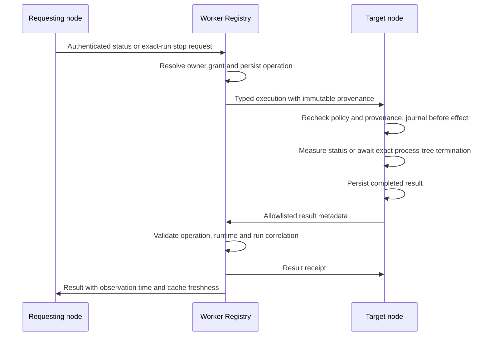

# Control Plane architecture

The Worker authenticates enrolled nodes over outbound WebSockets. `NodeSession`
terminates each connection; `Registry` owns shared identities, messages, task
requests and owner-control records in SQLite. Local node policy remains an
additional execution gate. The [README](README.md#architecture) maps the existing
modules and operator API.

The Worker keeps one authenticated WebSocket per node identity. When a newer
connection replaces it, the older daemon receives close code 4409, clears its
connection timers and exits instead of reconnecting. Unknown or revoked identity
code 4403 is terminal too; transport closes continue through the bounded backoff.

## Remote MCP candidate

The daemon serializes native-intent polling with other node frames. It registers cached known callers first; unresolved callers refresh and publish the complete current session snapshot on that same connection before their intents. Discovery is bounded by two seconds and the remaining local enqueue window; expired unregistered intents stop retrying. Periodic discovery waits outside the frame lane and is cancelled by any newer recorded listing or socket closure, preventing stale publication and late record updates while retaining its ordinary budget. The daemon rereads policy after native discovery, publishes capability changes, and rechecks authentication and MCP opt-in before allocating the snapshot. Warm callers avoid discovery. Unsent snapshots remain eligible for republication, and failed discovery leaves the prior population intact without sending an unknown-session intent. The Registry's session/runtime requirement and the eight-second trusted-hook deadline are unchanged. The ordered flow is shown in [MCP.md](MCP.md#components).

The optional `/mcp` route composes a stateless official SDK v2 handler with the existing Registry and message router. It adds no protocol-session Durable Object. A per-node bearer authenticates HTTP, while each tool effect also requires a short-lived native call intent registered and durably acknowledged over that node's authenticated WebSocket. Registry claim and message creation share one transaction for write tools. Capability, credential version and exact session runtime are rechecked at claim time.

The base `mcp.messaging.v1` opt-in enables Codex. Claude Code also requires literal
`remoteMcp.claudeCode: true`, advertised as `mcp.messaging.claude.v1`. Its hook records the actual
native session and tool-use ID before HTTP; the HTTP claim carries only the actual Claude native
tool-use ID and resolves the source session from that prior intent. Codex continues to supply native
session, thread and call metadata. Mixed identity fields are refused, and neither path accepts
model-supplied session identity. Removing only the extra Claude capability deletes its intents while
preserving Codex intents and the shared credential; re-enabling cannot revive deleted intents.
The exact identity contracts are tabulated in [MCP.md](MCP.md#runtime-specific-native-identity).

Inbox reads use a typed in-memory request on the originating `NodeSession`. The response is accepted only from the socket that received the request. Body text is returned to the waiting HTTP call and is absent from command history, Registry storage, audits and logs. Reading does not advance delivery state. [MCP.md](MCP.md) defines the complete flow, activation gates and tested limits.

The route flag and node capability both default off. Credential provisioning happens only on the authenticated node socket. The daemon applies policy changes on each exchange round and before processing authentication completion. Removing the MCP opt-in immediately blocks local inbox and intent handling and clears private local MCP exchange state. The daemon retries a reduced registration after a failed socket send; once received, Registry capability retraction transactionally invalidates the credential and intents. Reconnect polling resends only unacknowledged local intent metadata while enabled; idempotent Registry registration preserves the original expiry and does not rewrite an unchanged intent.

Registry admission separates the per-node limit of 128 unexpired intents from the replay ledger limit of 32,768 retained rows. A claim does not release active capacity before the intent's original expiry. Rows become eligible for pruning 24 hours after that expiry; a later new request-ID registration prunes them at the exact boundary before checking both limits. Exact duplicate registration is resolved before pruning or capacity checks and preserves the original row.

Codex can project an additional disabled-by-default local stdio client. Claude Code has a separate
explicit client-only installer, with a hook-only plugin and named MCP configuration activated per
invocation. It changes no persistent settings, MCP registries or permissions, refuses drift in its
closed managed directory and uses the existing reversible bootstrap transaction. Both clients use
the same bridge. It opens no listener
and reloads the node config, effective policy and private rotating credential for every outbound
Streamable HTTP call. The node config supplies the endpoint origin; the bridge converts secure
WebSocket to HTTPS and targets `/mcp`. It forwards native JSON-RPC and `_meta` unchanged, places the
bearer only in the HTTP Authorization header, and emits fixed local errors. The exact five-tool
PreToolUse hook registers intent metadata before returning updated arguments. Claude emits no
permission decision; Codex retains its required allow-plus-rewrite contract. Normal native MCP
approval remains separate.
On Windows the daemon creates the credential with a protected current-user DACL before writing its
bytes, publishes it atomically, then verifies the published ACL and content through the bridge's
strict reader. That reader uses native .NET ACL and `SecurityIdentifier` APIs without PowerShell
cmdlets or account-name translation. The bearer reaches the fixed Windows PowerShell helper only
through bounded stdin.
Installer opt-in changes only the selected client projection; Worker and node runtime activation stay separate.

MCP inbox RPC bounds the fully serialized UTF-8 envelope against the unchanged frame limit. An oversized response becomes a fixed actionable error that the HTTP tool explicitly preserves through error sanitization. No partial message list, body truncation, cloud result journal or delivery-state mutation is introduced.

## Owner task control

`protocol-task-control.mts` defines strict event bodies carried in the existing
`event` envelope. This does not widen the generic command allowlist.

- `worker/src/task-control-grants.mts` binds immutable task, owner, target and
  runtime identities to delegated requests or authenticated source messages.
  Source-message associations have monotonic versions; delayed registrations
  cannot restore an older discovery mapping. Existing task ownership is preserved.
- `worker/src/task-control-store.mts` persists operations by owner and request id.
  A conflicting reuse is denied. Results must match the recorded target, action,
  runtime and expected run. Pending operations can be retried by their exact id.
- `worker/src/task-control-registry.mts` checks ownership, capabilities and
  revocation before resolving, dispatching or returning a request. Routing and
  frames modules connect that store to authenticated node sockets.
- `node/task-control-registration.mts` retains successful grant receipts and
  registration history for local intercom delivery associations.
- `node/task-control-store.mts` journals execution before any effect and saves
  results before sending. Restart recovery reports uncertainty without replaying
  a process signal. The daemon serializes control operations across reconnects.
- `node/task-control-local.mts` checks current policy and local provenance, measures
  process identity and calls the awaited Codex stop path. A run hash binds task,
  runtime, process id and process creation time; these process details stay local.
- `node/task-control-cli.mts` queues requests and distinguishes a status timeout
  before stop submission from a pending submitted stop.

## Durable write budget

The Registry reconciles each changed session snapshot inside one atomic transaction:
new rows are inserted, absent rows are deleted, and existing rows are updated only
when stored metadata differs. Duplicate ids keep the final snapshot entry.
Session `updated_at` is the last metadata change, while directory `fetchedAt`
records response freshness. A duplicate sequenced node frame may advance its
cumulative acknowledgement, but it does not refresh liveness or dispatch again.

## Accepted-message delivery progress

Read-only `node/msg-inbox.mts` inspection resolves the caller's verified session references against both the current inbox target and the retained original `closedTo` address after fallback handover. It exposes the current destination and available delivery task/session identifiers. Hook delivery and `--receive` continue matching the current target exclusively, so inspection does not create a second delivery owner.

The target node reports optional fixed progress on the existing authenticated `message.status` path while the canonical state remains `accepted`. The Registry accepts it only from the stored target node, persists strictly newer observations in additive columns, relays the metadata-only projection to the sender, and clears it on a forward state transition. A same-state duplicate changes neither audit nor sender traffic.

Delivery hooks own `inbox/<messageId>.json`; the daemon owns `inbox/progress/<messageId>.json`; Worker receipts remain in `inbox/receipts/<messageId>.json`. This split prevents a stale daemon read and write from restoring an older delivery state. A receipt settles progress only when `storedProgressAt` covers the current observation. Nodes connected to an older Worker back off before retrying an unacknowledged observation.

Senders read `running` and `stopped` as refinements of `accepted`, derived from those progress codes by one shared function (`senderState`). No new wire state exists, because an older Worker rejects an unknown state in `isNodeMessageStatusBody` and would leave a newer node retrying forever. An accepted message without progress for 5 minutes is shown with a fixed actionable reason instead of a bare `accepted`; the bound is evaluated on the sender, so it also covers an offline or older target node.

Claude progress comes from the current successful session snapshot and freshly loaded node policy. Each accepted message resolves once: an exact session id precedes names, a unique name resolves to one session, and a shared name produces one stable `ambiguous-target` observation. An already offered message remains `awaiting-turn-confirmation`. Codex progress annotates the existing single queue or app-delivery attempt. For Codex task sessions, the message resume records the code of the guard that holds it, `wake-failed` for a failed start and `awaiting-turn-confirmation` for the messages a run carries, while a separate observer marks messages for active tasks `target-busy` and for operator-stopped tasks `operator-stopped`. Closed-session fallback annotates its existing start or resume path. These observations add no wake attempt, permission, transcript read, or message-body persistence.
## Exchange recovery

The sender's outbox file is removed only after the Worker's answer has been written to `sent/`, so a daemon crash between the socket send and that write leaves the file to be sent again by the next daemon. On a live connection an unanswered send is repeated after 30 seconds. The Worker's `messageId` deduplication answers every repeat with the current state and creates no second delivery. A target that crashes before its `accepted` answer leaves the message `queued`; the Worker hands it over again after the next authentication, and the idempotent inbox keeps the first record. A message whose target never returns expires after 24 hours and the sender is told. Inbox retention refuses rather than deletes a waiting record and keeps final records until their state is confirmed.

## Trust and data boundaries

`sessions.ownTaskControl` defaults to false. Both nodes must advertise the dedicated
capability, and the target must permit the runtime. Revocation and target policy
remain effective after initial registration. Operator tasks are not owner grants.
An enrolled node is the authenticated principal; a session name is a routing label,
not a security boundary between Desktop chats.

Task-control storage contains identifiers, state, observation time and fixed error
codes. It does not transport prompts, message bodies, transcripts, local paths or
process ids. Existing message delivery and its body-retention rules are unchanged.
Fresh measurement and cached results are explicit; connectivity or missing data is
never evidence that a process stopped. Claude process state remains unknown and its
remote stop is unsupported until an equivalent live identity check exists.

## Compatibility and activation

Ship the Worker and node source together, then explicitly activate node policy.
Older nodes without the capability cannot participate. Existing task records without
trusted provenance are not granted ownership retroactively. A local intercom task
can register once its source message and delivery identity are available. Reverting
the opt-in policy disables execution without removing the durable audit records.
