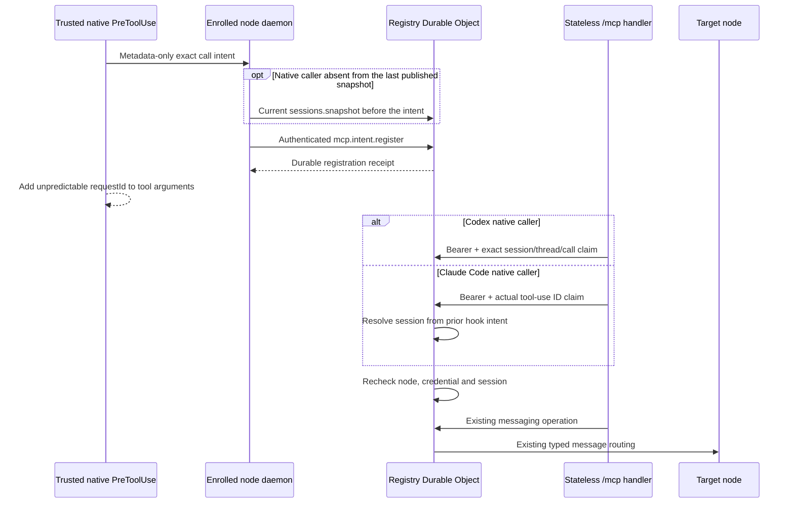

# Remote MCP candidate

This source candidate exposes the existing control-plane messaging router through a stateless Streamable HTTP endpoint. It remains disabled in the committed Worker config and in the default node policy. See issue [#127](https://github.com/cfaysal/kherep/issues/127) for the actual-client acceptance gates.

## Components



- `protocol-mcp.mts` defines the base and Claude runtime capabilities, five tool names, canonical argument digest, runtime-specific intent metadata and typed node frames.
- `worker/src/mcp-http.mts` uses the official SDK v2 stateless `createMcpHandler` transport at `/mcp`.
- `worker/src/mcp-registry.mts` stores credential hashes and bounded intent metadata in the existing Registry Durable Object.
- `node/mcp-intent-hook.mts` creates an intent only for the exact `mcp__kherep_messaging__*` tools. Callers omit `requestId`; the hook rejects an input that already contains it, waits for the Registry receipt, and then adds the generated id through the supported native rewrite result. Normal MCP approval remains separate.
- `node/mcp-stdio-bridge.mts` is the shared opt-in stdio bridge for the Codex and Claude Code native call contracts. It reloads local state per request, derives `/mcp` from the node control URL, and carries the current bearer only in the HTTP Authorization header.
- `node/claude-mcp-client.mts` projects the optional Claude client as a closed public module graph, hook-only plugin and separate MCP configuration. Its dedicated installer preserves persistent settings and MCP registries.
- `node/mcp-local.mts` keeps the raw bearer and metadata exchange files in the private Kherep config directory. Inbox text crosses the authenticated WebSocket response in memory and is not written to an MCP result journal.
- `node/session-publication.mts` has no runtime dependencies and is included in the installed client graph. Periodic recording remains in the daemon's `node/periodic-session-publication.mts` module.

The daemon awaits native-intent polling on its existing ordered connection. It registers cached known callers before awaiting discovery for the unresolved subset, so an unknown caller cannot starve them. The unresolved subset refreshes the complete session listing once and sends its changed snapshot before intent registration. First-call discovery is bounded by two seconds and the remaining local enqueue window inside the unchanged eight-second native-hook deadline. Expired unregistered local intents are removed without inventing a receipt. Cancellation reaches the discovery executable, and late results cannot update local session records. After discovery, the daemon reloads the policy file and publishes any capability change before allocating the snapshot frame. Authentication and MCP opt-in are then rechecked. Known callers and empty or inflight-only rounds add no session discovery. A failed snapshot send blocks unresolved registrations and invalidates that cached snapshot for the next round. A failed or timed-out listing leaves the previous population intact and sends no unknown-session intent.

Periodic session discovery retains its normal budget but waits outside the ordered frame lane. Its publication and task maintenance join that lane. Any newer recorded listing, including native discovery and an ordinary `session.list` command, cancels an outstanding periodic listing or queued publication; an aborted listing cannot rewrite session records or publish a stale snapshot. Socket closure also cancels it. Task maintenance still runs after listing failure or cancellation on the current connection.

No MCP protocol session Durable Object is added. Each HTTP request creates a fresh SDK server. MCP transport session ids, `clientInfo`, tool arguments and shared connector identity are not authorization inputs.

## Codex client transport

The Codex installer exposes an explicit `--enable-messaging-client` CLI switch and
`InstallOptions.messagingClient` API option. Without it, the installation contains no messaging MCP
table or intent hook. With it, the managed table starts the local bridge over stdio and passes only
its installed path and the non-secret Kherep config-root path. The installer does not enable node
policy or the Worker route.

For each native JSON-RPC request or notification, the bridge reloads `node.json`, its effective
policy file and `mcp/credential.json`. The credential must be an owned private regular file. POSIX
requires an owner-only mode; Windows verifies the current-user owner and permits read grants only to
that user, SYSTEM and local administrators. On Windows the daemon creates a random temporary file
with a protected current-user `FullControl` DACL in the `FileStream` constructor, before it writes
the credential bytes. The fixed Windows PowerShell 5.1 helper receives those bounded UTF-8 bytes
only on stdin, runs by absolute `SystemRoot` path with an allowlisted environment and the built-in
module path, and never receives the bearer in arguments or environment. Each helper run, the write
and every ACL check, is limited to 5 s. Only a run that hit this limit runs once more, after the
writer removes the temporary file of the timed-out attempt; any other failure, and a second timeout,
fail closed (issue #219). The limit stays at 5 s because an operator host with Defender on started
the helper in 147 to 241 ms; a hosted `windows-latest` runner took 1.8 to 2.8 s idle and more than
5 s under test load, so the tests inject the helper and only those that must start the real one pass
a longer, test-only limit. Node atomically publishes
the file, then the strict reader verifies its ACL and content digest at the published path. The
Windows reader calls .NET [`File.GetAccessControl`](https://learn.microsoft.com/en-us/dotnet/api/system.io.file.getaccesscontrol?view=netframework-4.8.1)
for access and owner data, requests the owner through
[`GetOwner(SecurityIdentifier)`](https://learn.microsoft.com/en-us/dotnet/api/system.security.accesscontrol.objectsecurity.getowner?view=netframework-4.8.1),
and requests rules as `SecurityIdentifier` values. It uses no PowerShell cmdlets or account-name translation.
Links,
unsafe access, an unreadable ACL, invalid schema, missing state and a removed opt-in fail before
HTTP. The control URL is the only endpoint source. Secure WebSocket becomes HTTPS and the path becomes `/mcp`; credentials in
the URL are refused. The bearer exists only in the request Authorization header, with redirects
disabled and bounded request, response and deadline handling.

The request body crosses unchanged, including runtime-native `params._meta`. The bridge never creates
session, thread or call identifiers and never changes tool arguments. JSON and SSE responses become
stdio JSON-RPC responses; HTTP 202 for a notification produces no response. Fixed local error codes
contain no endpoint, credential or server body. The exact-tool hook returns `permissionDecision:
"allow"` together with `updatedInput`, as required by the [native Codex PreToolUse rewrite contract](https://learn.chatgpt.com/docs/hooks#pretooluse).
This result applies the argument rewrite; normal native MCP approval remains separate.

## Claude Code client transport

The separate `bootstrap/install-claude-messaging-client.sh` entry requires explicit existing absolute
`--home` and `--config-root` paths. It installs only `<home>/kherep/claude-messaging-client`; the broad
Claude adapter installer does not invoke it. `--node` selects the absolute executable used for
projection, verification and the imported transaction comparison. Without it, the installer resolves
Node from `PATH`. On Windows, invoke the installer through Git Bash with Bash-visible paths.

The closed client contains the same 14 public modules as the installed Codex client graph, a
hook-only plugin and a separately named `kherep_messaging` MCP configuration. It contains no node
state or credentials. A fixed file population, manifest hashes and regenerated configuration bind
the installed artifact. The installer refuses drift, extra or missing files, a mismatched target
identity and symlinked content before replacement. It stages the candidate, checks the target again
under the shared bootstrap lock and uses the existing reversible transaction. Changed installations
retain the previous closed directory in the installation backup; a failed transaction restores it.

Activate only the intended Claude invocation with the printed arguments:

```sh
claude --plugin-dir /absolute/client-root/plugin \
  --mcp-config /absolute/client-root/mcp.json --strict-mcp-config
```

This invocation selects the supplied MCP configuration. Other persistent MCP entries, user hooks
and permissions remain unchanged. The plugin adds only the exact five-tool PreToolUse matcher. It
uses structured executable arguments, including `--runtime claude-code`; no shell constructs,
listener, bearer, environment credential or automatic permission grant are rendered. Node policy
and Worker activation remain separate operator actions. See [installation](../../docs/INSTALLATION.md#optional-claude-messaging-client).

The trusted Claude hook binds its actual native `session_id` and `tool_use_id`. After the unchanged
eight-second durable positive-receipt check, it returns `updatedInput` without a `permissionDecision`.
Normal Claude tool approval still applies. Claude's HTTP request supplies the actual
`_meta["claudecode/toolUseId"]`; the bridge forwards it unchanged and never invents a native session
or thread field. The Registry resolves the source session only from the exact prior hook intent.

## Authentication and intent claim

Credential provisioning is available only as `mcp.credential.rotate` on an authenticated enrolled-node WebSocket. The Registry stores only a SHA-256 hash and the current credential version. Rotation within an active opt-in increments the version and removes outstanding intents. Base capability retraction or node revocation removes the credential and all intents, so later opt-in provisions a new token even when its fresh row starts again at version 1. The raw token returns only to that same node and is stored with its local helper files. Every MCP HTTP request verifies the current node, capability, revocation state and credential version.

The node must advertise `mcp.messaging.v1`, which requires this exact local policy opt-in for Codex:

```json
{
  "version": 1,
  "allowedCommands": [],
  "remoteMcp": { "enabled": true }
}
```

Claude Code additionally requires literal `remoteMcp.claudeCode: true` alongside literal
`enabled: true`. This advertises `mcp.messaging.claude.v1`; an existing Codex-only policy does not
enable Claude. For both native runtimes, the relevant policy section is:

```json
{ "remoteMcp": { "enabled": true, "claudeCode": true } }
```

The daemon reloads this policy on every exchange round. Removing the base opt-in updates the connected client before further inbox or intent work, publishes a reduced registration, deletes the node's Registry credential and intents in that registration transaction, and clears local credential and intent exchange files. Restoring the base opt-in publishes the capability first and provisions a new credential version; an older bearer does not become valid again.

Removing only the Claude runtime capability transactionally deletes retained Claude intents while
preserving Codex intents and the shared credential. Re-enabling it cannot revive the deleted
intents. Claude capability is rechecked at registration, first claim and recovery. The node also
rechecks the current runtime policy before reading an inbox.

The trusted hook registers these fields before the MCP request:

- unpredictable UUID `requestId`
- enrolled node and current credential version, assigned by the Registry
- runtime `codex` or `claude-code`, selected by the trusted hook invocation
- exact native `sessionId` and `callId`
- exact tool name
- SHA-256 digest of canonical JSON arguments before `requestId` is added
- creation time and fixed expiry

The default intent lifetime is 120 seconds. A requested lifetime may be shorter and cannot exceed 300 seconds. Idempotent registration keeps the original expiry. An expired call receives `intent expired; register a fresh native intent` and requires a new native call.

### Runtime-specific native identity

| Runtime | Trusted hook intent | Native HTTP claim | Source binding |
| --- | --- | --- | --- |
| Codex | Actual session and call, optional retained native thread | `_meta.sessionId`, `_meta.threadId`, `_meta.callId` | Exact stored session and call; first claim binds thread, recovery must retain it |
| Claude Code | Actual hook `session_id` and `tool_use_id`, no thread | `_meta["claudecode/toolUseId"]` only | Exact prior intent supplies the session; native tool-use ID must match |

Claude registration and claim refuse a thread field. HTTP refuses missing or invalid native
identifiers and mixed Claude/Codex identity fields, including partial Codex fields. A caller cannot
supply its source through tool arguments, `clientInfo` or an MCP transport session. Both claim
paths recheck the live node's required capabilities, credential version and exact Registry session
runtime. Removal or runtime replacement of the originating session invalidates first use and recovery.

### Authorization denials

Every denied call returns a fixed error and creates no message. Write tools return the same fixed
claim error as read tools; only a routing failure after a successful claim stays generic.

| Case | Caller-visible result |
| --- | --- |
| Wrong binding: another call, session, thread or node, or changed arguments | `native call identity does not match intent`, `intent not found` or `tool arguments do not match intent` |
| Missing binding: no or partial native metadata, or no registered intent | `verified native call metadata is required` or `intent not found` |
| Replayed request: a used `requestId` from another native call | `native call identity does not match intent` |
| Expired binding | `intent expired; register a fresh native intent` |
| Revoked node, superseded credential or removed opt-in | HTTP 401 `{"error":"unauthorized"}` before any tool runs |

The trusted hook adds its own fixed denials before HTTP, such as `remote_mcp_request_id_must_be_native`
and `remote_mcp_intent_rejected`. `worker/test/mcp-denials.test.mts` covers each case and asserts that
no message exists for either node.

`requestId` is the `messageId` for `send` and `reply`. A retry claims the same intent and calls the existing message router with the same immutable id. Router idempotency prevents a second message. Routing failures after the Registry write return an explicit uncertain result and require retrying the same native call.

Intent rows contain identifiers, digests, timestamps and one fixed outcome value. They contain no message body, inbox result or arbitrary tool result. Unchanged registration retries do not write or extend the row.

Each node may hold at most 128 unexpired intents. Claimed intents continue to count until their original expiry. Expired rows remain as replay metadata for 24 hours after that original expiry, bounded to 32,768 retained rows per node. Before admitting a new request ID, the Registry removes only rows whose original `expires_at` is at or before `now - 24 hours`, then checks the unexpired and retained limits independently. The fixed errors are `too many unexpired MCP intents` and `too many retained MCP intents`. Duplicate lookup remains first: an exact duplicate keeps its original identity and expiry, while changed metadata is refused.

## Tools

| Tool | Behavior |
| --- | --- |
| `sessions` | Returns bounded address references from Registry metadata, with the node-reported `kind` when present |
| `send` | Sends through the existing message router from the verified originating session |
| `inbox` | Reads the exact originating session inbox from its online node, without changing message state |
| `reply` | Derives the recipient from stored message provenance and enforces the reply-depth limit |
| `status` | Returns metadata-only state for a message visible to the caller's node |

A `sessions` entry carries `kind` when the node reported one. `codex-task` marks a Codex task run
the node started on request, `codex-intercom` a Codex Intercom run the node started on its own for
peer messages (issue #198), and `codex` a Codex session recorded by its hooks. Other runtimes' kinds
pass through as their node reported them. A node older than `codex-intercom` reports its Intercom
runs as `codex-task`. The kind is node-reported metadata; it does not imply that the run appears in
a desktop session list.

For a `replied` message, `status` also returns `replyMessageId`: the reply that marked the message
replied, recorded by the Registry at that moment. A reply refused at send time never marks the
original and is never named; a marking reply that its recipient later refuses stays named. Messages
marked replied before this column existed carry no `replyMessageId`. The sending session can read
the reply with `status` and, while its node is online, with `inbox`.

For an accepted message, `status` also returns validated `progress` metadata when available: a fixed `phase` and `code`, `observedAt`, and optional `retryAt`. These codes distinguish waiting for a user turn, waking, fallback activity and delivery failures. Accepted progress does not prove delivery. Invalid progress and stale progress on terminal states are omitted. Arbitrary persisted reasons and message bodies are never included in a status result. `state` stays the canonical state. `status` also returns `senderState` (issue #197), the state a sender reads, derived from `state` and the returned `progress` by `senderState` in `protocol-messages.mts`, the function `msg status` uses: `running` for `awaiting-turn-confirmation` and `fallback-running`, `stopped` for `operator-stopped`, otherwise the canonical state. `running` reports the last observation, not liveness. An `accepted` message without progress whose `updatedAt` is at least 5 minutes before the Worker's clock (`silentlyAccepted`, `ACCEPTED_SILENCE_MS`) also carries `hint`: a fixed text naming the possible causes (target session not running, target node offline or on an older version) and the `sessions` tool as the next check. `hint` never contains a persisted reason. Clients that read only `state` are unaffected.

Inbox has three distinct results: items, a successful empty list, or a fixed offline/read error. The body transits from the expected authenticated node socket directly to the waiting HTTP request. It does not enter `SessionStore`, the command-result journal, Registry SQLite, an audit record or a log. The read uses the exact current session id. Alias ownership is not inferred from a reused display name.

Codex CLI replies preserve the full sender session id supplied by the delivery hook, so a native MCP message and its CLI response retain the same exact identities. Explicit aliases remain supported by the CLI, but historical alias messages are not reinterpreted as full-id hops in a native reply chain.

An inbox read is read-only. Returning text over HTTP does not mark a message offered or delivered and does not prove that a chat saw or understood it. Existing delivery hooks and `message.receipt` remain the delivery confirmation path.

The complete serialized inbox response must fit the existing 64 KiB transport limit, measured as UTF-8 bytes including JSON escaping and envelope metadata. If the requested messages do not fit, the tool returns a fixed error rather than truncating messages, omitting records or reporting a successful empty inbox. Retry with a smaller `limit` and a fresh native intent. If one message alone exceeds the serialized limit, use the local `msg inbox` CLI. Message bodies and delivery state remain unchanged.

## Measuring native ACK latency

The ACK of a native call is the trusted hook's durable intent receipt: the Registry's
`mcp.intent.receipt` for the hook's exact intent, which the daemon writes locally and the hook
consumes before it returns the rewritten arguments. The hook waits at most eight seconds for it.
The later MCP HTTP tool result is the call's outcome, not its ACK.

To measure, create the private directory `<config-root>/control-plane/mcp/diagnostics` on the
calling node. While it exists, the hook appends one JSON line per receipt wait to
`ack-latency.jsonl` there. A file reaching 64 KiB is rotated once to `ack-latency.jsonl.1`. Remove
the directory to stop recording; without it the hook writes nothing and behaves unchanged.

Each record has `method: "hook-intent-receipt"`, `runtime`, `tool`, `outcome` (`accepted`,
`rejected`, `timeout` or `storage_error`), `ackWaitMs`, `hookMs`, `pollIntervalMs`, `at` and
`hookSha256`. `ackWaitMs` is measured with the monotonic clock from the published local intent file
to the observed receipt, so it covers daemon pickup, any first-caller session discovery, the
WebSocket round trip and the Registry write. Receipt observation polls every 25 ms, so the value is
an upper bound within that interval. For `timeout` it is the time waited, not an ACK. `hookMs`
additionally includes argument digesting and the local write. The records contain no session,
call or request identifiers, arguments or bodies.

Not measured: model time before the call, client approval prompts, the MCP HTTP request after the
hook, peer delivery and the whole fixture or script duration.

Report a result per platform with the `ackWaitMs` of a real native `send` record whose `outcome`
is `accepted`, the method above, the client version (`codex --version` or `claude --version`, plus
the Desktop build where used), the Worker target, and the source commit. Identify the commit by
matching `hookSha256` with `git show <commit>:modules/control-plane/node/mcp-intent-hook.mts`
hashed with SHA-256.

## Activation gates

The committed `REMOTE_MCP_ENABLED` value is `false`, and the default node policy has no `remoteMcp` section. This candidate does not change live config.

Source tests use synthetic native metadata. They cover SDK transport, client and runtime opt-in, provisioning, revocation, per-call credential rotation, local policy removal, session removal, runtime replacement, missing or mixed metadata, changed arguments, cross-node reuse, expiry, recovery, online and offline inbox behavior, metadata-body exclusion, bounded JSON and SSE responses, and secret-free installed settings. The isolated Claude client tests also execute the copied hook and bridge, verify the fixed module graph and cover target drift, unchanged independent settings, idempotence and rollback. These tests do not establish actual-client support.

Before activation, the production Codex path needs a successful direct canary and two-distinct-chat canary against the deployed backend, including missing-metadata denial and the supported `permissionDecision: "allow"` plus `updatedInput` hook result under normal approval. A Code Mode binding-probe success is evidence for that probe only and is not production authentication.

Actual compatibility canaries measured Claude Code 2.1.283 on macOS on 2026-10-02: the real hook
session and tool-use ID joined the actual MCP metadata, the required request-ID schema worked after
native rewrite, and the real session appeared in native discovery. The [recorded evidence](https://github.com/cfaysal/kherep/issues/127#issuecomment-5958977972)
establishes that contract, rather than delivery of this adapter. Issue [#187](https://github.com/cfaysal/kherep/issues/187)
also requires an actual native CLI canary after the accepted adapter reaches its target. Production
ACK latency, normal permissions, two-session isolation and both-host messaging remain separate
acceptance gates in [#127](https://github.com/cfaysal/kherep/issues/127); lifecycle and Windows
process/window/Stop acceptance remain in [#128](https://github.com/cfaysal/kherep/issues/128).

## Dependencies

The Worker pins `agents` 0.24.0, `@modelcontextprotocol/server` 2.0.0 and `zod` 4.6.5. `agents` and Zod ship MIT license texts. The MCP SDK server package declares MIT in its package metadata and ships its upstream transition notice with Apache-2.0, MIT and CC-BY-4.0 terms for the material each term covers. Kherep continues under Apache-2.0. The transport follows Cloudflare's current stateless `createMcpHandler` guidance; `McpAgent` is not used.
