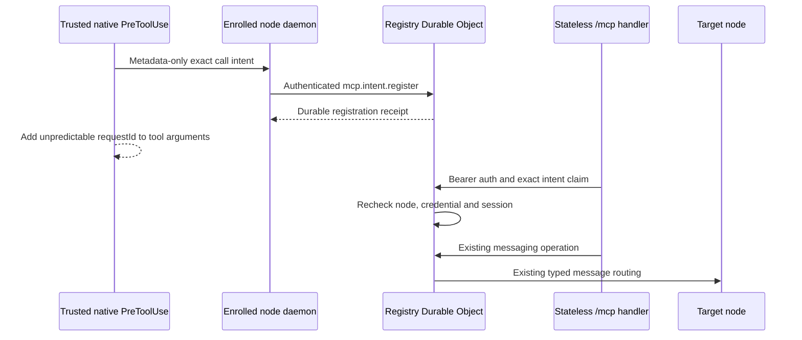

# Remote MCP candidate

This source candidate exposes the existing control-plane messaging router through a stateless Streamable HTTP endpoint. It remains disabled in the committed Worker config and in the default node policy. See issue [#127](https://github.com/cfaysal/kherep/issues/127) for the actual-client acceptance gates.

## Components



- `protocol-mcp.mts` defines the capability, five tool names, canonical argument digest, intent metadata and typed node frames.
- `worker/src/mcp-http.mts` uses the official SDK v2 stateless `createMcpHandler` transport at `/mcp`.
- `worker/src/mcp-registry.mts` stores credential hashes and bounded intent metadata in the existing Registry Durable Object.
- `node/mcp-intent-hook.mts` creates an intent only for the exact `mcp__kherep_messaging__*` tools. It rejects an input that already contains `requestId`, waits for the Registry receipt, and then adds the generated id. It does not approve the tool call.
- `node/mcp-stdio-bridge.mts` is the opt-in Codex stdio client. It reloads local state per request, derives `/mcp` from the node control URL, and carries the current bearer only in the HTTP Authorization header.
- `node/mcp-local.mts` keeps the raw bearer and metadata exchange files in the private Kherep config directory. Inbox text crosses the authenticated WebSocket response in memory and is not written to an MCP result journal.

No MCP protocol session Durable Object is added. Each HTTP request creates a fresh SDK server. MCP transport session ids, `clientInfo`, tool arguments and shared connector identity are not authorization inputs.

## Codex client transport

The Codex installer exposes an explicit `--enable-messaging-client` CLI switch and
`InstallOptions.messagingClient` API option. Without it, the installation contains no messaging MCP
table or intent hook. With it, the managed table starts the local bridge over stdio and passes only
its installed path and the non-secret Kherep config-root path. The installer does not enable node
policy or the Worker route.

For each native JSON-RPC request or notification, the bridge reloads `node.json`, its effective
policy file and `mcp/credential.json`. The credential must be an owned private regular file. POSIX
requires an owner-only mode; Windows verifies the current-user owner and permits read grants only to
that user, SYSTEM and local administrators. On Windows the daemon creates a random temporary file
with a protected current-user `FullControl` DACL in the `FileStream` constructor, before it writes
the credential bytes. The fixed Windows PowerShell 5.1 helper receives those bounded UTF-8 bytes
only on stdin, runs by absolute `SystemRoot` path with an allowlisted environment and the built-in
module path, and never receives the bearer in arguments or environment. Node atomically publishes
the file, then the strict reader verifies its ACL and content digest at the published path. Links,
unsafe access, an unreadable ACL, invalid schema, missing state and a removed opt-in fail before
HTTP. The control URL is the only endpoint source. Secure WebSocket becomes HTTPS and the path becomes `/mcp`; credentials in
the URL are refused. The bearer exists only in the request Authorization header, with redirects
disabled and bounded request, response and deadline handling.

The request body crosses unchanged, including Codex native `params._meta`. The bridge never creates
session, thread or call identifiers and never changes tool arguments. JSON and SSE responses become
stdio JSON-RPC responses; HTTP 202 for a notification produces no response. Fixed local error codes
contain no endpoint, credential or server body. The exact-tool hook returns `updatedInput` only, so
normal native MCP approval remains separate.

## Authentication and intent claim

Credential provisioning is available only as `mcp.credential.rotate` on an authenticated enrolled-node WebSocket. The Registry stores only a SHA-256 hash and the current credential version. Rotation within an active opt-in increments the version and removes outstanding intents. Capability retraction or node revocation removes the credential and intents, so later opt-in provisions a new token even when its fresh row starts again at version 1. The raw token returns only to that same node and is stored with its local helper files. Every MCP HTTP request verifies the current node, capability, revocation state and credential version.

The node must advertise `mcp.messaging.v1`, which requires this exact local policy opt-in:

```json
{
  "version": 1,
  "allowedCommands": [],
  "remoteMcp": { "enabled": true }
}
```

The daemon reloads this policy on every exchange round. Removing the opt-in updates the connected client before further inbox or intent work, publishes a reduced registration, deletes the node's Registry credential and intents in that registration transaction, and clears local credential and intent exchange files. Restoring the opt-in publishes the capability first and provisions a new credential version; an older bearer does not become valid again.

The trusted hook registers these fields before the MCP request:

- unpredictable UUID `requestId`
- enrolled node and current credential version, assigned by the Registry
- runtime `codex`
- exact native `sessionId` and `callId`
- exact tool name
- SHA-256 digest of canonical JSON arguments before `requestId` is added
- creation time and fixed expiry

The default intent lifetime is 120 seconds. A requested lifetime may be shorter and cannot exceed 300 seconds. Idempotent registration keeps the original expiry. An expired call receives `intent expired; register a fresh native intent` and requires a new native call.

At tool execution, native MCP `_meta.sessionId`, `_meta.threadId` and `_meta.callId` are required. The stored session and call must match. The first exact claim binds `threadId`; recovery must present the same value. Claim also rechecks the live node capability, credential version and Registry session runtime. Removal or runtime replacement of the originating session invalidates first use and recovery.

`requestId` is the `messageId` for `send` and `reply`. A retry claims the same intent and calls the existing message router with the same immutable id. Router idempotency prevents a second message. Routing failures after the Registry write return an explicit uncertain result and require retrying the same native call.

Intent rows contain identifiers, digests, timestamps and one fixed outcome value. They contain no message body, inbox result or arbitrary tool result. Unchanged registration retries do not write or extend the row.

## Tools

| Tool | Behavior |
| --- | --- |
| `sessions` | Returns bounded address references from Registry metadata |
| `send` | Sends through the existing message router from the verified originating session |
| `inbox` | Reads the exact originating session inbox from its online node, without changing message state |
| `reply` | Derives the recipient from stored message provenance and enforces the reply-depth limit |
| `status` | Returns metadata-only state for a message visible to the caller's node |

Inbox has three distinct results: items, a successful empty list, or a fixed offline/read error. The body transits from the expected authenticated node socket directly to the waiting HTTP request. It does not enter `SessionStore`, the command-result journal, Registry SQLite, an audit record or a log. The read uses the exact current session id. Alias ownership is not inferred from a reused display name.

An inbox read is read-only. Returning text over HTTP does not mark a message offered or delivered and does not prove that a chat saw or understood it. Existing delivery hooks and `message.receipt` remain the delivery confirmation path.

The complete serialized inbox response must fit the existing 64 KiB transport limit, measured as UTF-8 bytes including JSON escaping and envelope metadata. If the requested messages do not fit, the tool returns a fixed error rather than truncating messages, omitting records or reporting a successful empty inbox. Retry with a smaller `limit` and a fresh native intent. If one message alone exceeds the serialized limit, use the local `msg inbox` CLI. Message bodies and delivery state remain unchanged.

## Activation gates

The committed `REMOTE_MCP_ENABLED` value is `false`, and the default node policy has no `remoteMcp` section. This candidate does not change live config.

Source tests use synthetic native metadata. They cover SDK transport, client and node opt-in, provisioning, revocation, per-call credential rotation, local policy removal, session removal, runtime replacement, missing metadata, changed arguments, cross-node reuse, expiry, recovery, online and offline inbox behavior, metadata-body exclusion, bounded JSON and SSE responses, and secret-free installed settings. They do not establish actual-client support.

Before activation, the production Codex path needs a successful direct canary and two-distinct-chat canary against the deployed backend, including missing-metadata denial and the updatedInput-only hook result under normal approval. A Code Mode binding-probe success is evidence for that probe only and is not production authentication. Claude Code remains disabled until its runtime metadata join is proven.

## Dependencies

The Worker pins `agents` 0.24.0, `@modelcontextprotocol/server` 2.0.0 and `zod` 4.6.5. `agents` and Zod ship MIT license texts. The MCP SDK server package declares MIT in its package metadata and ships its upstream transition notice with Apache-2.0, MIT and CC-BY-4.0 terms for the material each term covers. Kherep continues under Apache-2.0. The transport follows Cloudflare's current stateless `createMcpHandler` guidance; `McpAgent` is not used.
